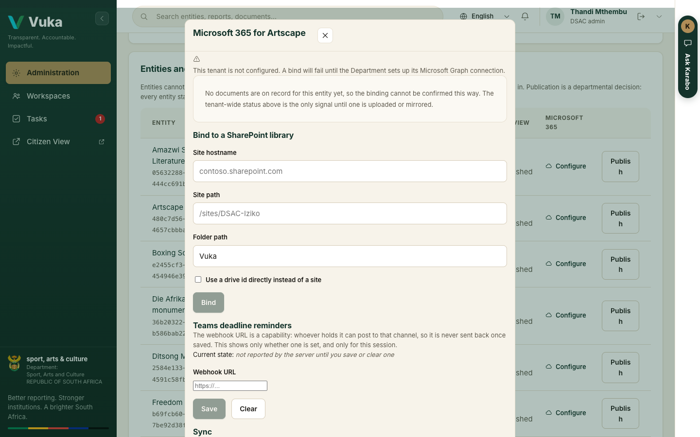

# Setting up: the administrator

[Back to the manual](README.md)

> **In short:** The administrator sets when each quarter is due, gives each entity one reporter account, links it
> to Microsoft 365, and decides which entities the public can see. They never touch a reported figure.

**Who this is for:** the DSAC administrator who decides who reports, by when, and what the public
sees.

**What you will do:** set a quarter's due date, issue an entity its reporter account, connect an
entity's documents to Microsoft 365, publish an entity to the citizen view, and register a new
entity.

Nothing on the Administration screen touches a reported figure. The administrator also cannot
approve a submission: whoever decides what the public sees is not the person who approves the
figures it will see.

---

## 1. Open Administration

Sign in. You land on **Administration**.

The three tiles at the top count how many entities are **published** to the citizen view, how many
have **no reporter account** yet, and how many have **no targets registered**.

## 2. Set a quarter's due date

For a Schedule 3A entity, Treasury Regulation 30.2.1 sets no day count for quarterly performance
reporting, so the due date is the Department's instruction. It is set here, once per quarter, for
every entity.

1. Find the quarter in **Submission deadlines** and pick the new date in the **Change** column (1).
2. Click **Set** (2).

The row updates at once, with the new date and the days left.

Every reporter's countdown, the lateness measure in the risk score and the reminders all read this
one date. Reminders go by email at 30 days, 15 days and on the last day. Where an entity's
workspace has a Teams channel set (step 4), the same countdown is posted there, hourly on the last
two days.

**Bringing a date forward warns the reporters.** A reporter whose quarter now falls due within 30
days, and who has not submitted, sees a warning the next time they sign in. See
[J1, step 1](J1-reporting-from-your-desk.md#1-sign-in-and-find-your-quarter).

Vuka refuses four kinds of change, and says why:

- A deadline that has **passed** cannot be moved. The quarter shows **Passed, fixed**, because
  lateness was already measured against it.
- A new date cannot be in the past.
- It cannot fall before the quarter ends.
- It cannot be later than a statutory deadline, where one applies.

Every change is written to the audit log with your name.

## 3. Issue a reporter account

Scroll to **Entities and their reporters**. Each row shows the entity, its sector, how many targets
are registered for the year, its reporters, whether it is published, and its Microsoft 365 link.

1. Click **Issue an account** on the entity's row (1).
2. Enter the person's **Full name** and **Work email**, then click **Issue an account**.

The account can report for that entity and nothing else. The person can only sign in; they cannot
sign up or choose a different entity.

- Where the deployment is connected to its sign-in service, Vuka shows a **set-password link**.
  Send it to the person. The password never passes through DSAC.
- Where it is not, Vuka says **Recorded, no credential issued**. The person is recorded so they
  still receive the entity's reminders, and the row says **(no credential)**, as below.

## 4. Connect an entity to Microsoft 365

Click **Configure** in the **Microsoft 365** column (2 in the row above).

The dialog has three parts:

- **Bind to a SharePoint library.** Enter the **Site hostname** and **Site path** (or tick the box
  to give a drive id instead) and a **Folder path**, then click **Bind**. From then on, each
  document the entity uploads to Vuka is mirrored to that library, and each document's row in
  **Documents** shows whether its copy has synced.
- **Teams deadline reminders.** Paste the channel's workflow **Webhook URL** and click **Save**.
  The deadline countdown is then posted to that channel. Vuka never shows a saved webhook address
  back, because whoever holds it can post to the channel.
- **Sync.** Picks up, straight away, files saved in the bound folder from Word, Excel or Teams.
  Vuka also checks the folder by itself every five minutes. Each file arrives as a new version,
  with the name of the person who saved it.

Documents are always held in Vuka, with their versions and receipts, whether or not a library is
bound, and nothing about the evidence behind a figure depends on the mirror.

In the demonstration copy no Microsoft tenant is connected, so the dialog says **This tenant is not
configured** and a bind fails until the Department sets up its Microsoft Graph connection.

## 5. Publish an entity to the citizen view

Nothing reaches the public until the Department publishes the entity. Every entity starts
unpublished.

1. Click **Publish** (3 in the row above) on the entity's row.
2. The **Citizen view** column changes to **published** (1), and the button becomes **Unpublish**.

Click **Citizen View** at the top of the page to see what the public now sees. See
[J5. The citizen view](J5-citizen-view.md).

## 6. Register a new entity

1. Click **Register an entity** at the top right.
2. Enter the name, a short name, the sector, the PFMA schedule and, if you have them, a contact
   person and email. Deadline reminders go to the contact email as well as to the reporters.
3. Click **Register**. Then issue its reporter account as in step 3.

The new entity starts unpublished, with no targets and no reporter. It appears in the review queue
at once, with nothing filed.

---

Next: [J1. Reporting from your desk](J1-reporting-from-your-desk.md)
