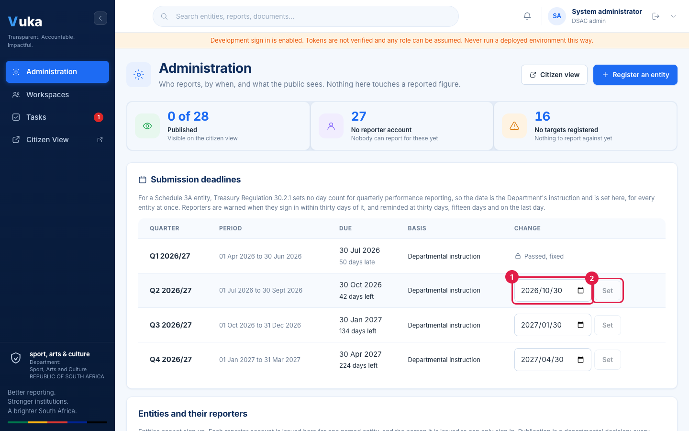
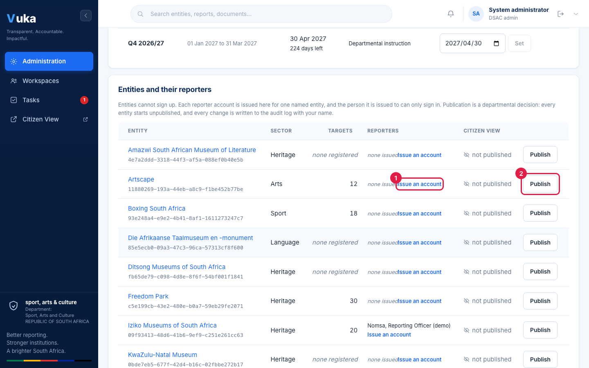
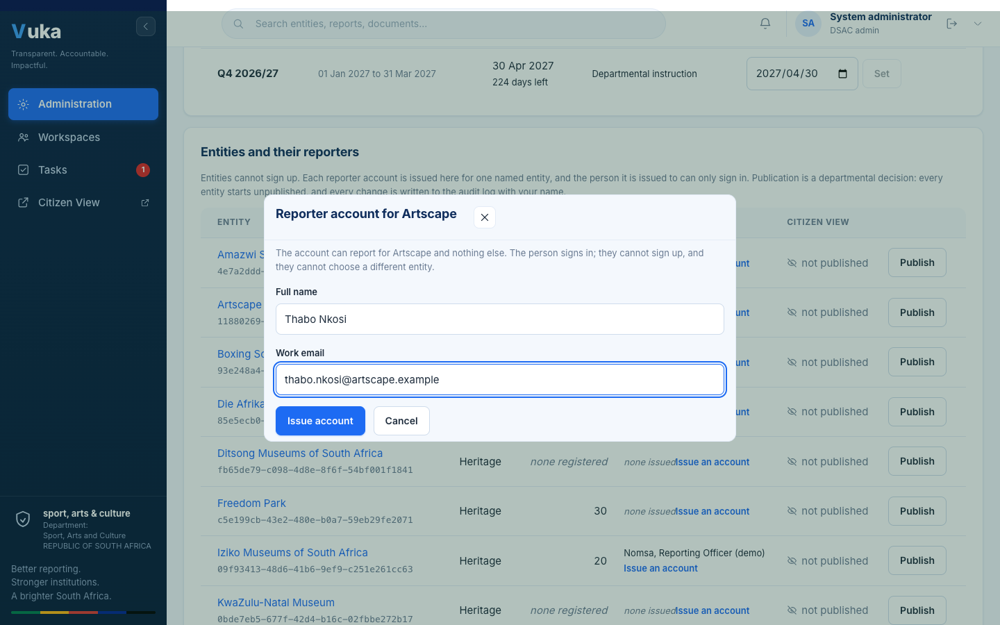
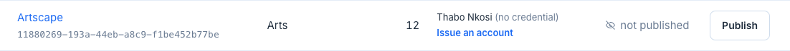
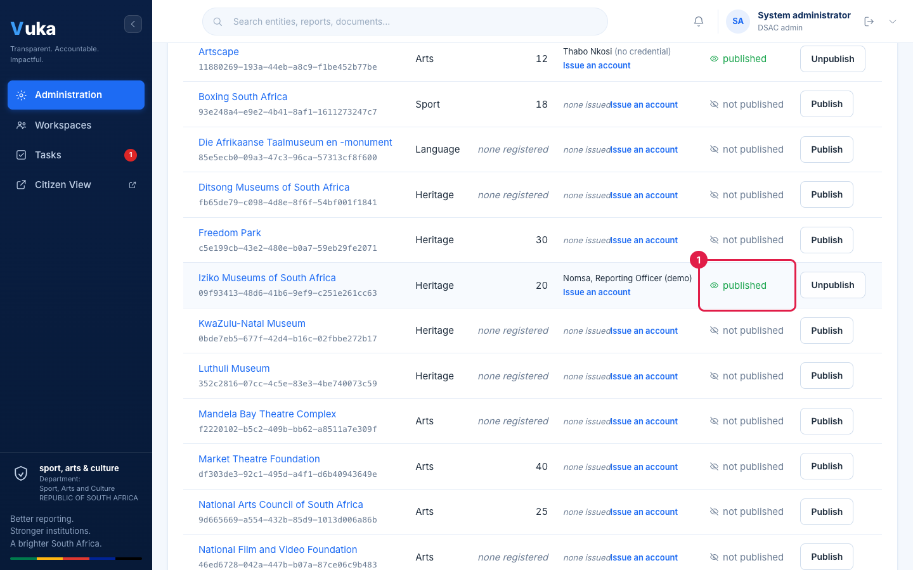
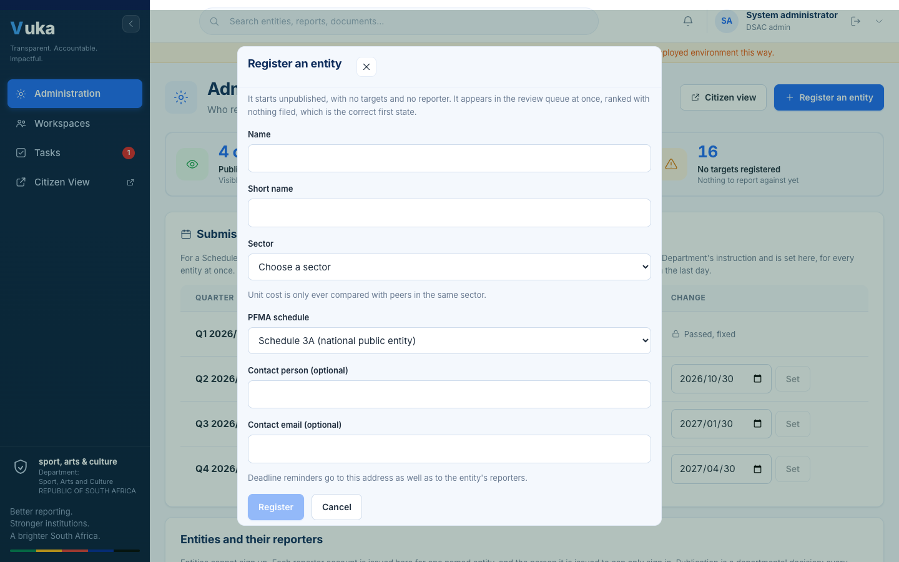

# Setting up: the administrator

[Back to the manual](README.md)

**Who this is for:** the DSAC administrator who decides who reports, by when, and what the public
sees.

**What you will do:** set a quarter's due date, issue an entity its reporter account, publish an
entity to the citizen view, and register a new entity.

Nothing on the Administration screen touches a reported figure. The administrator also cannot
approve a submission: whoever decides what the public sees is not the person who approves the
figures it will see.

---

## 1. Open Administration

Sign in. You land on **Administration**. The three tiles at the top count how many entities are
published, how many have no reporter account yet, and how many have no targets registered.

## 2. Set a quarter's due date

For a Schedule 3A entity, the regulations set no day count for quarterly performance reporting, so
the due date is the Department's instruction. It is set here, once per quarter, for every entity.

1. Find the quarter in **Submission deadlines**.
2. Pick the new date in the **Change** column (1).
3. Click **Set** (2).

Every reporter's countdown, the reminders at 30 days, 15 days and on the last day, and the lateness
measure in the risk score all read this one date.

Vuka refuses four kinds of change, and says why:

- A deadline that has **passed** cannot be moved. The quarter shows **Passed, fixed**, because
  lateness was already measured against it.
- A new date cannot be in the past.
- It cannot fall before the quarter ends.
- It cannot be later than a statutory deadline, where one applies.

Every change is written to the audit log with your name.

## 3. Issue a reporter account

Scroll to **Entities and their reporters**. Each row shows the entity, its sector, how many targets
are registered for the year, its reporters and whether it is published.

1. Click **Issue an account** on the entity's row (1).

2. Enter the person's **Full name** and **Work email**, then click **Issue account**.

The account can report for that entity and nothing else. The person can only sign in; they cannot
sign up or choose a different entity.

- Where the deployment is connected to its sign-in service, Vuka shows a **set-password link**.
  Send it to the person. The password never passes through DSAC.
- Where it is not, Vuka says **Recorded, no credential issued**. The person is recorded so they
  still receive the entity's reminders, and the row says **(no credential)**, as below.

Click **Done** to close the form.

## 4. Publish an entity to the citizen view

Nothing reaches the public until the Department publishes the entity. Every entity starts
unpublished.

1. Click **Publish** on the entity's row.
2. The **Citizen view** column changes to **published** (1), and the button becomes **Unpublish**.

Click **Citizen view** at the top of the page to see what the public now sees. See
[J5. The citizen view](J5-citizen-view.md).

## 5. Register a new entity

1. Click **Register an entity** at the top right.
2. Enter the name, a short name, the sector, the PFMA schedule and, if you have them, a contact
   person and email.
3. Click **Register**. Then issue its reporter account as in step 3.

---

Next: [J1. Reporting from your desk](J1-reporting-from-your-desk.md)
