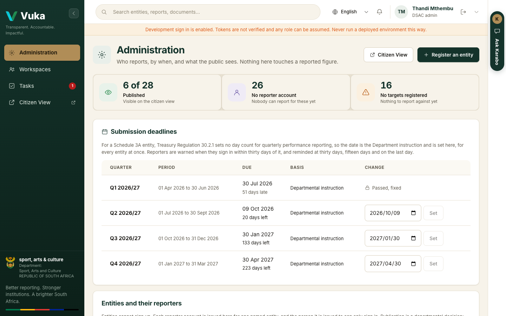
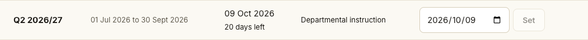

# 1. The administrator

[Back to the manual](README.md)

> **In short:** The administrator decides when each quarter is due, who may report for each entity,
> and which entities the public can see. They never touch a reported figure.

**Signs in as:** Administrator, from the Demonstration accounts panel.

**The journey:** open Administration, bring the Q2 deadline forward, give Artscape a reporter
account, and publish four entities to the public.

---

## Step 1. Open Administration

After signing in you land on **Administration**.

The three counts at the top say how many entities are **published** to the public, how many have
**no reporter account** yet, and how many have **no targets registered**. Under them is the table
of **Submission deadlines**, one row per quarter.

## Step 2. Bring the Q2 deadline forward

Every DSAC entity is a Schedule 3A public entity, and the regulations set no day count for its
quarterly report. So the due date is the Department's instruction, and it is set here.

1. In the **Q2 2026/27** row, pick the new date in the **Change** column (1). Here, 9 October 2026.
2. Click **Set** (2).

The row changes at once: due 9 October, 20 days left.

This one date drives everything else: every reporter's countdown, the reminders at 30 days, 15
days and on the last day, and the lateness part of each entity's risk score. Because Q2 is now due
within 30 days, Iziko's reporter will be warned the next time they sign in (see
[the reporter, step 1](3-reporter.md#step-1-sign-in-and-read-the-warning)).

Vuka will not let a date be moved once it has passed, because lateness was already measured
against it. The row then says **Passed, fixed**, as Q1 does. Every change is written to the audit
log in the administrator's name.

## Step 3. Give Artscape a reporter account

Scroll to **Entities and their reporters**. Each row is one entity, with its sector, its targets
for the year, its reporters, and whether the public can see it.

1. On Artscape's row, click **Issue an account** (1).
2. Type the person's **Full name** and **Work email**, and click **Issue an account**.

The row now lists Thabo Nkosi as Artscape's reporter.

That account can report for Artscape and nothing else. Nobody can sign up to Vuka or choose their
own entity: the entity is part of the account the Department issues. On a real deployment Vuka
gives the administrator a link to send the person, so they set their own password. Here the
screen says **no credential**, because the demonstration copy has no sign-in service behind it.

(The **Configure** button, marked 2, links an entity's documents to Microsoft 365. It is not part
of this journey.)

## Step 4. Publish entities to the public

Nothing is public until the Department says so. Every entity starts unpublished.

1. Click **Publish** (3 in the row above) for Artscape, Iziko Museums, the South African Heritage
   Resources Agency and Robben Island, and for Boxing South Africa and the Market Theatre.
2. Each row's **Citizen view** column changes to **published** (1), and the button becomes
   **Unpublish**.

The administrator's journey ends here. Note what they could not do: change a figure, or approve a
submission. Deciding what the public sees and approving what it will see are two different
people's jobs.

---

Next: [2. The reviewer](2-reviewer.md)
