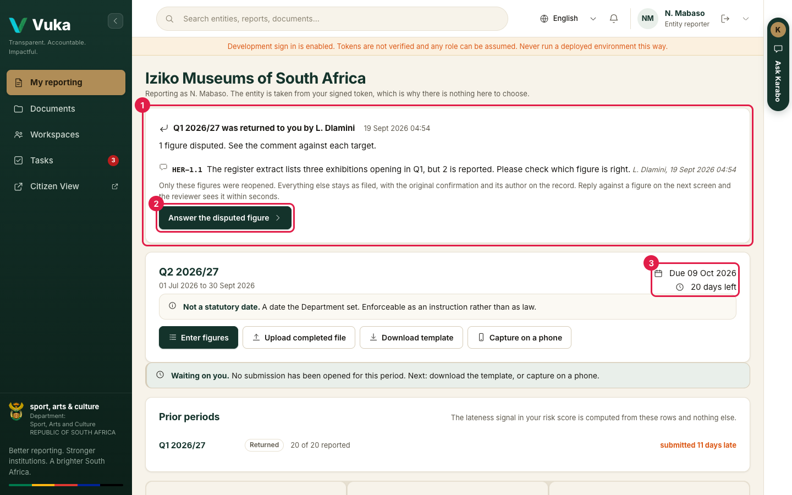
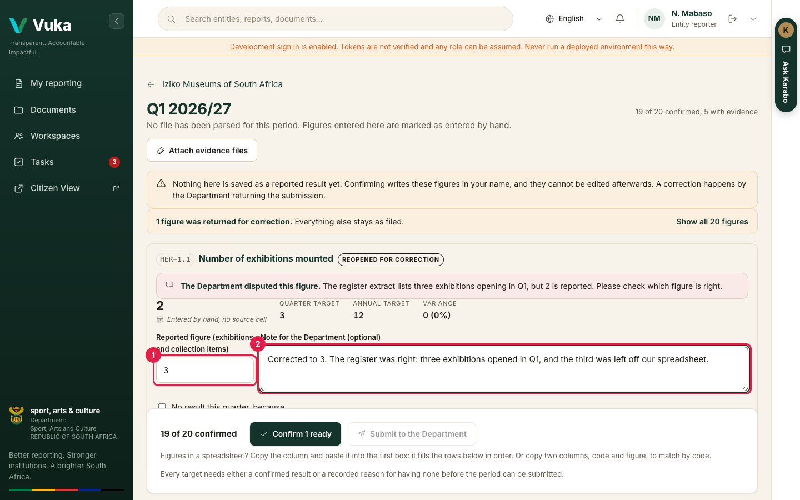
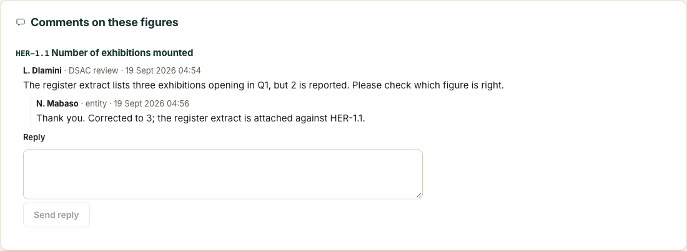
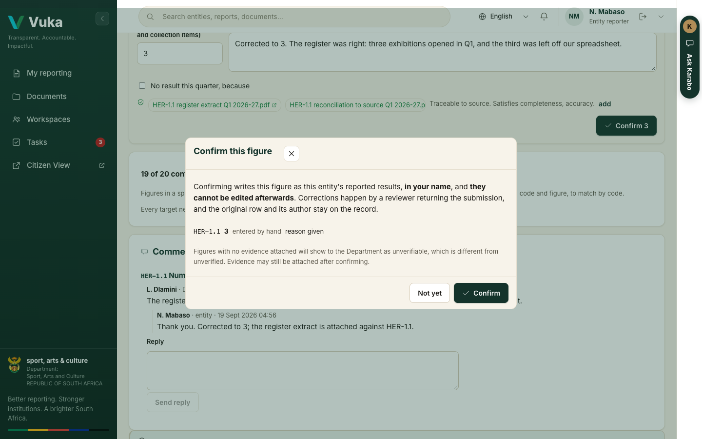
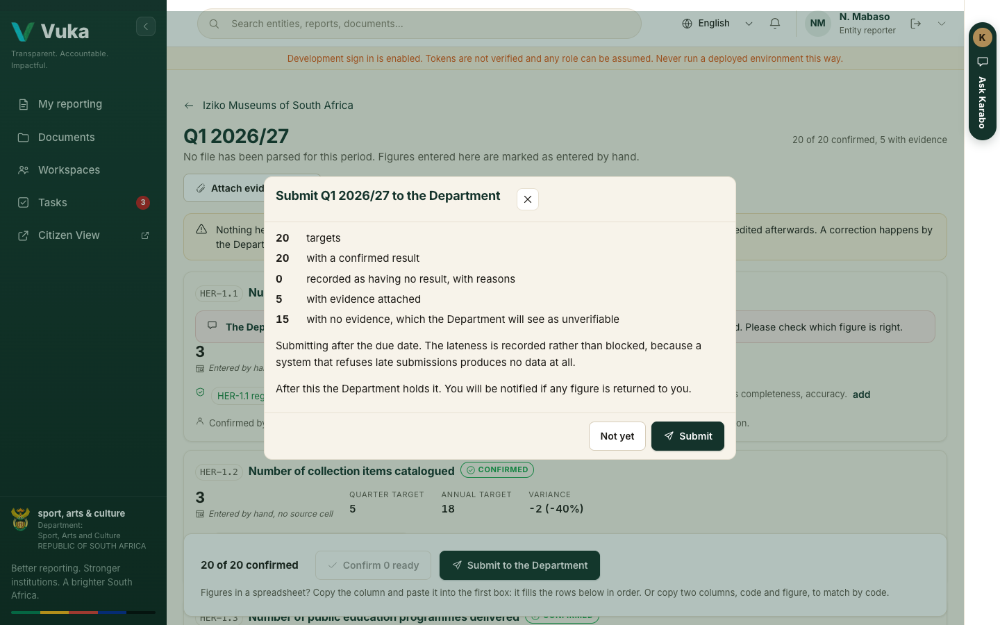
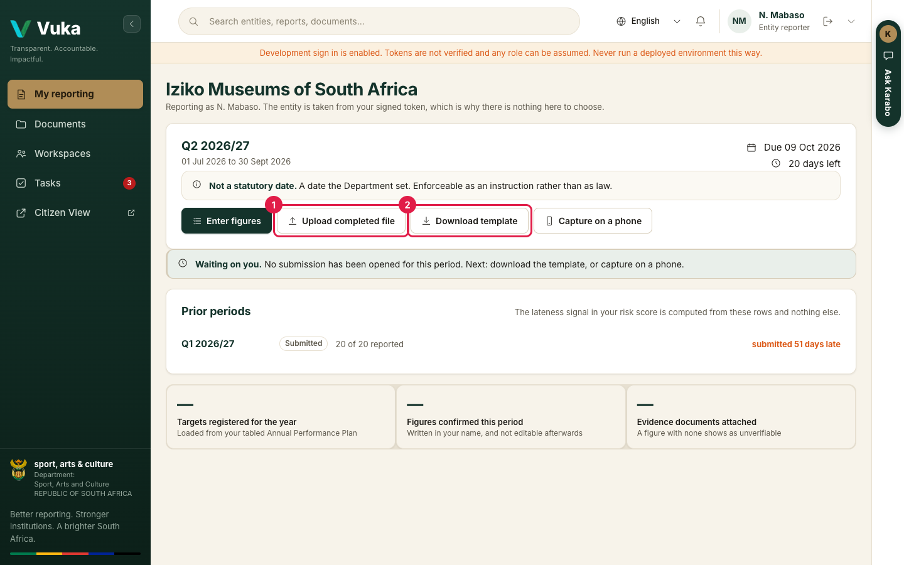

# 3. The reporter

[Back to the manual](README.md)

> **In short:** The reporter at an entity is warned when a quarter is nearly due, answers any figure
> the Department sent back, and files the quarter from a spreadsheet, attaching the document behind
> each figure. Every figure they confirm is recorded in their name.

**Signs in as:** Entity reporter (N. Mabaso, Iziko Museums of South Africa).

**The journey:** read the deadline warning, answer the figure the reviewer returned and send Q1
back, then download, fill, upload and check the Q2 template, attach evidence, confirm and submit.

---

## Step 1. Sign in and read the warning

Because Q2 is now due within 30 days and nothing has been filed for it, Vuka warns you as soon as
you sign in.

It says when Q2 is due and that reminders come by email at 30 days, 15 days and on the last day.
**Report Q2 2026/27 now** goes straight to it. Click **Later** for now: something else comes first.

## Step 2. Your reporting

You land on **My reporting**. There is no entity to choose: Iziko's name comes from your account.

1. At the top, **Q1 2026/27 was returned to you by L. Dlamini**, with the time, and the one
   disputed figure with the reviewer's reason in their own words. It appears as soon as the
   reviewer returns it, without reloading the page.
2. **Answer the disputed figure** opens it.
3. Under it, **Q2 2026/27**: due 9 October, 20 days left. **Not a statutory date** means the
   Department set it as an instruction.

Click **Answer the disputed figure**.

## Step 3. Answer the returned figure

Only HER-1.1 is open again. The other 19 figures stay exactly as you filed them. The Department's
reason sits above the figure.

1. Type the corrected figure (1). Here, 3.
2. Say what changed in the note (2).

Further down, under **Comments on these figures**, reply to the reviewer. They see the reply
within seconds.

## Step 4. Confirm and send Q1 back

Click **Confirm 1 ready** at the bottom. Vuka shows the figure you are about to confirm and
reminds you what confirming means: it is recorded **in your name** and **cannot be edited
afterwards**.

Click **Confirm**, then **Submit to the Department**. The summary shows 20 targets, all with a
result, and how many have evidence. Click **Submit**.

The corrected 3 does not replace the 2. Both stay on the record, each with who confirmed it and
when.

## Step 5. Start Q2

Back on My reporting, Q1 now reads **Submitted**, and Q2 is waiting.

1. **Download template** (2) gives an Excel file already filled with Iziko's 20 targets, their
   indicator codes and the quarter. You type your actual figures into it and save it. Do not rename
   sheets or move rows: Vuka matches each row by its indicator code.
2. When it is filled in, click **Upload completed file** (1).

## Step 6. Upload the template

Click **Choose file** and pick the saved template (1), then **Upload and parse** (2).

Vuka reads it and says what it found (3): 21 rows read, 20 matched a registered target. The row
whose code matches nothing is **held aside**, not thrown away. **Nothing is saved as a reported
figure yet.**

Click **Review what was read**.

## Step 7. Check what Vuka read

Every target has its own row.

1. The reminder that nothing here is saved until you confirm it.
2. The figure Vuka read and **the cell it came from**, for example *from Quarterly Report!F11*, beside
   the quarter target, the annual target and the difference.
3. **attach**, to add evidence (step 9).

Nineteen rows are ready. One needs you.

## Step 8. Fill the gap

HER-1.3, public education programmes, says **Not parsed**: the spreadsheet had nothing in that cell.
Its **Confirm** button is off.

Type the figure. Here the programme delivered 2 against a quarter target of 6, which is more than 20
percent short, so Vuka asks for a **Reason for the variance (required)** before it lets you confirm.

Write the reason. A shortfall with no reason is the most common reason a submission is returned.

(If there were genuinely nothing to report, you would tick **No result this quarter, because** and
say why instead.)

## Step 9. Attach the evidence

Evidence is what lets the Department trace a figure back to a source document.

1. Click **attach** on HER-1.3.
2. Choose the document (1).
3. Tick which part of the Auditor-General's test it satisfies (2): **Validity** (it happened),
   **Accuracy** (the numbers are right), **Completeness** (nothing was left out).
4. Click **Attach** (3).

The document now shows under the figure with a green shield.

A figure with nothing attached is shown to the Department as **unverifiable**, which is worse than
evidence attached late.

## Step 10. Confirm all 20

The button at the bottom now reads **Confirm all 20** (1).

Vuka lists every figure you are about to confirm, each with the cell it came from, or **entered by
hand** for the one you typed.

Click **Confirm**.

## Step 11. Submit Q2

With all 20 confirmed, **Submit to the Department** (1) turns on.

The summary shows the targets, how many have a result, how many have evidence, and that you are
submitting 20 days before the due date. Click **Submit**.

My reporting now says **The Department holds it**: 20 of 20 targets reported. The reporter's
journey ends here.

---

Next: [4. The executive](4-executive.md)
