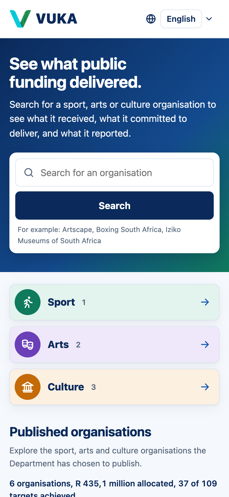
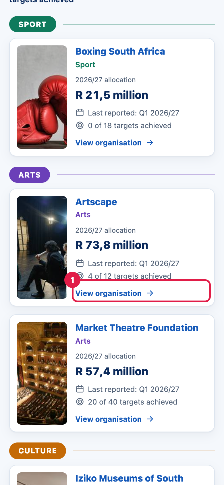
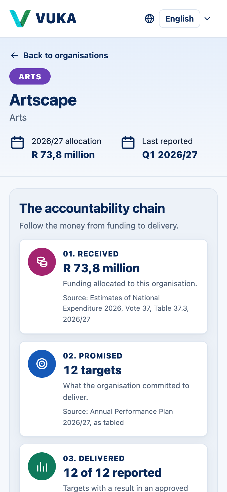
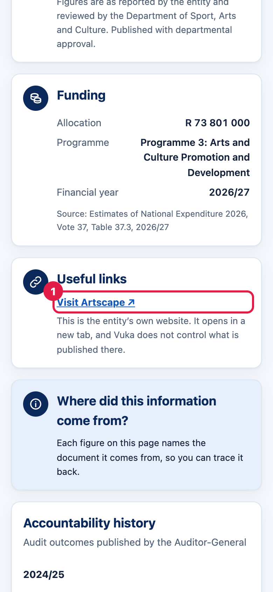
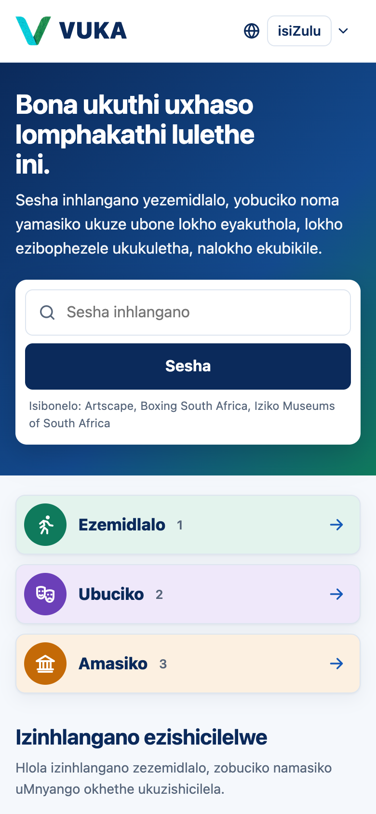
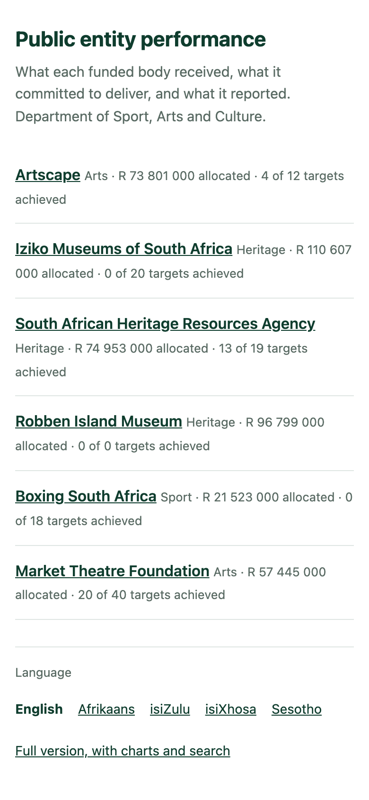
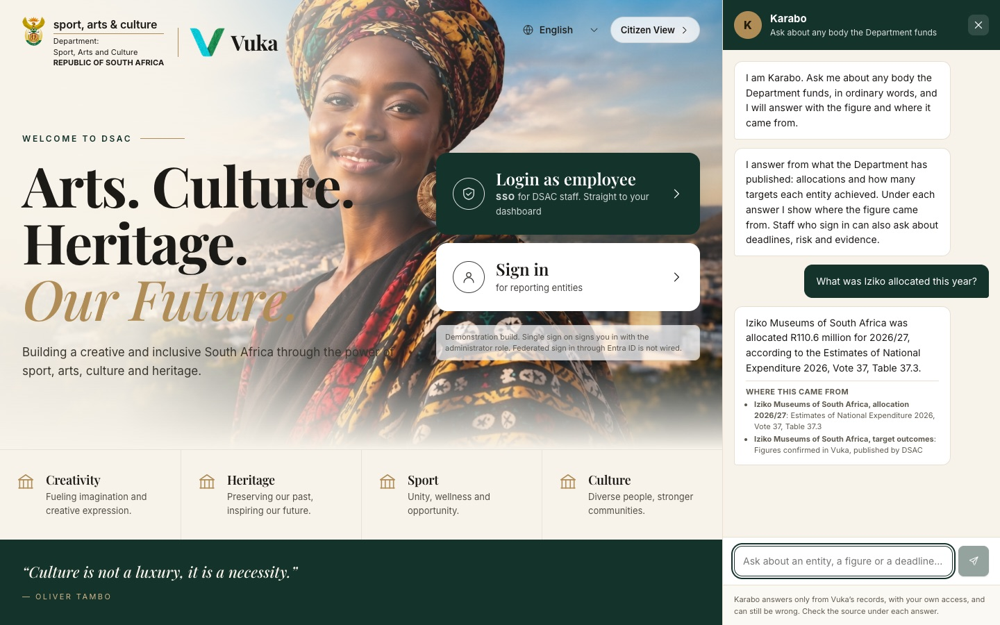
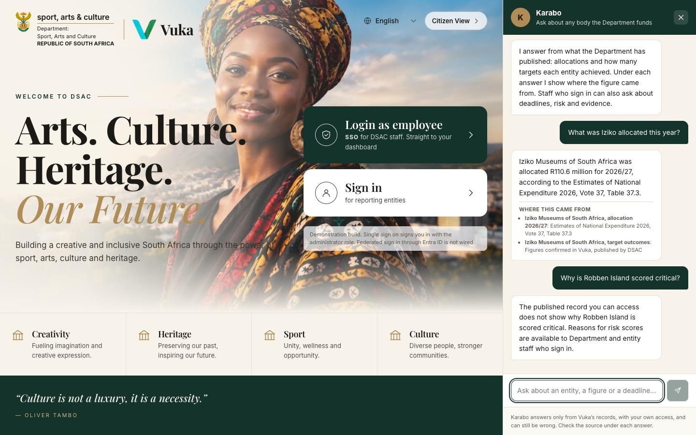

# 5. The public

[Back to the manual](README.md)

> **In short:** Anyone, with no account, can see what each published entity received, promised and
> delivered, in five languages, on a phone, and ask Karabo about it. They only ever see what the
> Department has chosen to publish.

**Signs in as:** nobody. The screenshots are taken at phone size.

**The journey:** open the citizen view, open Artscape's record, go on to Artscape's own website,
switch to isiZulu, try the light version, then ask Karabo from the landing page.

---

## Step 1. Open the citizen view

Go to the Vuka address followed by `/public`, or click **Citizen View** on the landing page.

Search for an organisation by name, or tap a group: **Sport**, **Arts** or **Culture** (heritage,
libraries and language bodies are under Culture). The six organisations the administrator
published are the only ones here.

## Step 2. Open Artscape

Each card shows the organisation's group, its allocation for the year, the last quarter it reported
with the Department's approval, and how many targets it has achieved. On Artscape's card, tap
**View organisation** (1).

The record follows the money in three steps, under **The accountability chain**: **01. Received**
(what it was allocated), **02. Promised** (the targets it committed to this year) and **03.
Delivered** (targets with a result in an approved report). Each figure names the document it comes
from.

Only results the Department has approved are counted here. A figure still with its reviewer is not
shown to the public as delivered.

## Step 3. Go to Artscape itself

Under **Useful links**, **Visit Artscape** (1) opens Artscape's own website in a new tab, for the
questions Vuka does not answer: what is on, how to visit, who runs it.

The page says plainly that it is the organisation's own website and not a government page.

## Step 4. Read it in isiZulu

Choose **isiZulu** from the language picker at the top. English, Afrikaans, isiZulu, isiXhosa and
Sesotho are available.

## Step 5. The light version

On a slow connection or a small data bundle, tap **Light version, uses less data** at the bottom.
The same organisations and figures, as plain text. Vuka also picks it by itself when the phone asks
to save data or has a slow connection.

## Step 6. Ask Karabo

Back on the landing page, click the **Ask Karabo** tab and ask *What was Iziko allocated this year?*

Karabo answers from what the Department has published, and shows **Where this came from**. A
visitor who asks about something only staff can see, here *Why is Robben Island scored critical?*,
is told that risk scores are for staff who sign in, and is given the published figures instead.

The public's journey, and the demonstration, end here.

---

Next: [Demonstration script](demo-script.md)
