# J1. Reporting from your desk

[Back to the manual](README.md)

> **In short:** Download the template, fill in your figures, upload it, attach the document behind each figure,
> confirm, and submit. If the Department doubts a figure, it comes back to you with a reason.

**Who this is for:** the reporting officer at an entity who keeps the quarter's figures in a
spreadsheet and reports from a computer.

**What you will do:** download the pre-filled template, fill in your actual figures, upload it,
check what Vuka read, attach evidence, confirm, and submit.

**Before you start:** you need a reporter account from DSAC. Have your figures and your supporting
documents (attendance registers, signed reports, photographs, invoices) to hand.

Nothing is filed until you confirm it. Uploading only reads the file.

---

## 1. Sign in and find your quarter

Sign in with your email address and password (see [Getting in](getting-in.md)).

**If a quarter is due within 30 days, or already late, Vuka warns you first.** The warning says
which quarter, when it is due, and that reminders go to your inbox at thirty days, fifteen days and
on the last day. Click **Report Q2 2026/27 now** to go straight to it, or **Later** to close it.
It appears once each time you sign in, and again only if the dates change.

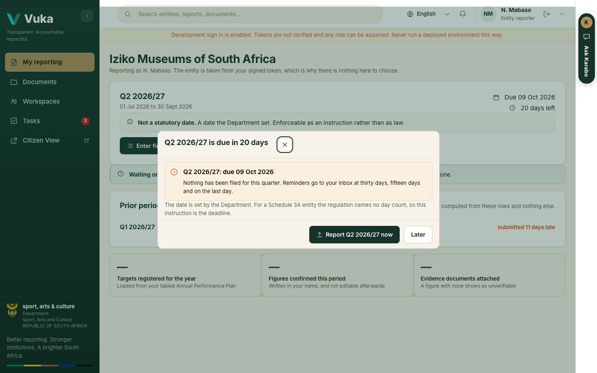

You land on **My reporting**.

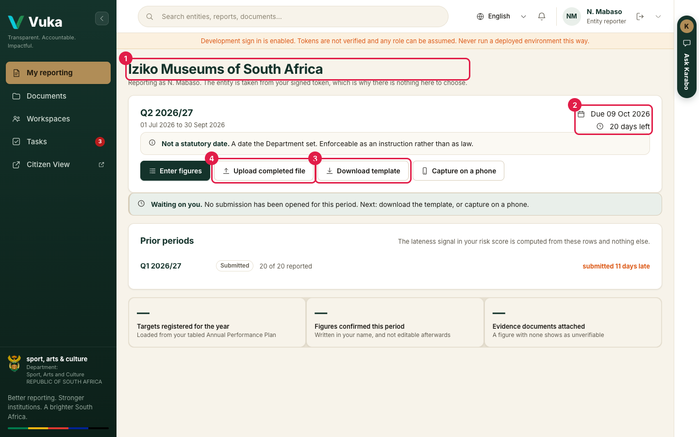

1. Your entity's name. It comes from your account, so there is nothing to choose.
2. The open quarter's due date and how many days are left. **Not a statutory date** means the
   Department set it as an instruction.
3. **Download template**, for step 2.
4. **Upload completed file**, for step 3.

The line under the quarter says what is waiting on you and what to do next. **Prior periods**
lists earlier quarters with how late each was filed; those rows are what the lateness part of your
risk score is worked out from.

If you would rather type figures straight into Vuka, click **Enter figures** and go to step 4.
**Capture on a phone** opens the phone pages; see [J2](J2-reporting-from-a-phone.md).

## 2. Download the template and fill it in

1. Click **Download template**. You get an Excel file already filled with your entity's registered
   targets, their indicator codes, their annual targets and the quarter.
2. Type your actual figures into the actuals column. Do not rename sheets, retype indicator names
   or move rows: Vuka matches each row by its indicator code.
3. Save the file.

Always use the template downloaded for **this** quarter. A blank spreadsheet with retyped indicator
names is the most common reason an upload cannot be matched.

## 3. Upload the completed file

1. Click **Upload completed file**.
2. Click **Choose file** and pick your saved template (1).
3. Click **Upload and parse** (2).

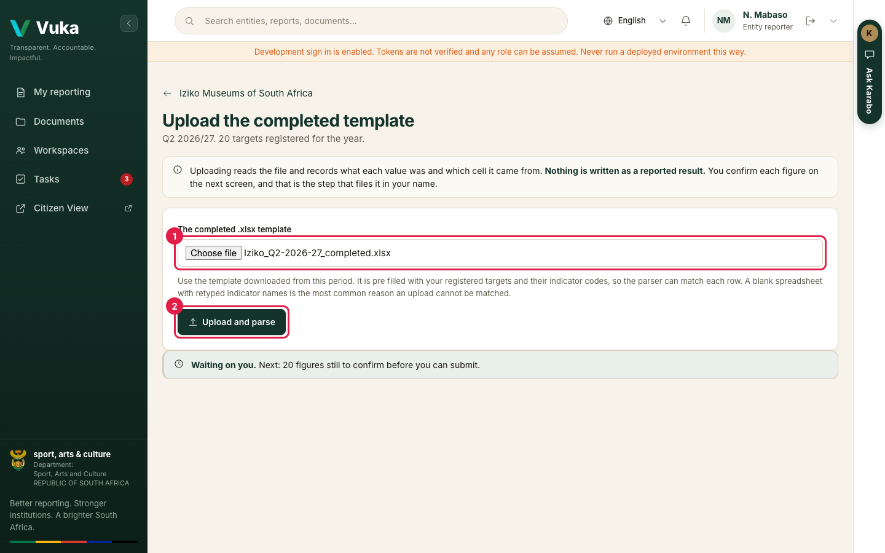

Vuka reads the file and tells you how many rows it read and how many matched a registered
target (3).

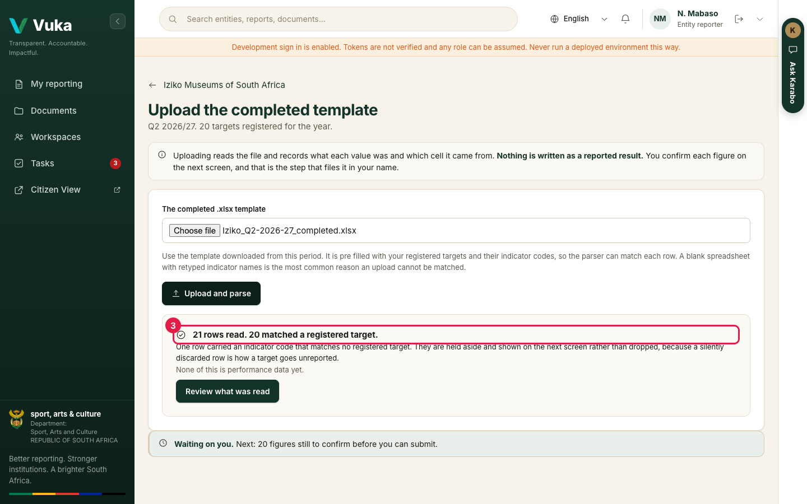

A row whose indicator code matches no registered target is **held aside**, not thrown away. You
will see it at the bottom of the next screen.

Click **Review what was read**.

## 4. Check what Vuka read

Each target has its own row.

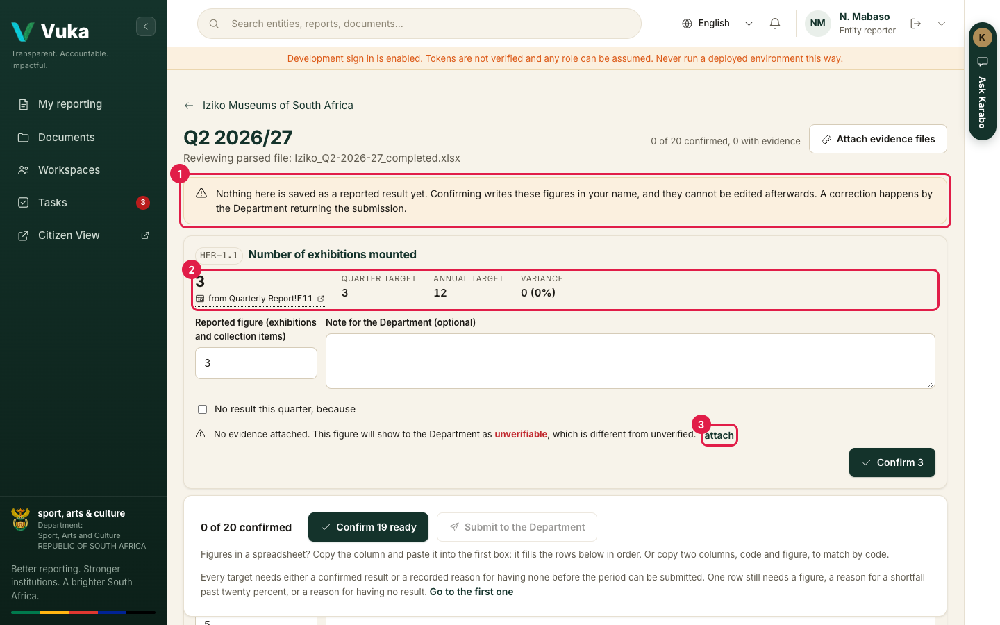

1. The warning: nothing on this page is saved as a reported result until you confirm it.
2. The figure Vuka read, the cell it came from (for example **from Quarterly Report!F11**), the
   quarter target, the annual target and the variance. Click the cell reference to open the file at
   that value.
3. **attach**, for step 5.

Most rows need nothing from you. Vuka stops you on three kinds of row, and each one says what it
needs. In the demonstration template there is exactly one such row, so the screen can be walked in
a minute; a real file usually has a few.

**No value found.** The file had nothing for this indicator, and the row says **Not parsed**. Its
**Confirm** button stays off.

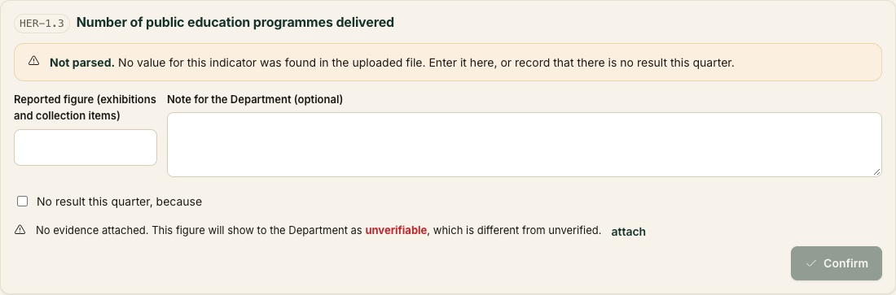

Either type the figure into **Reported figure**, or tick **No result this quarter, because** and say
why. With no result ticked, the button reads **Record no result**.

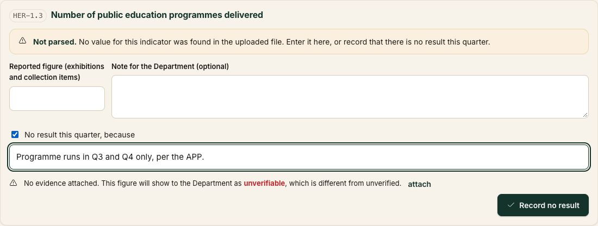

**A shortfall of more than 20 percent with no reason.** If the figure you type is more than 20
percent under the quarter target, the note becomes **Reason for the variance (required)** and
**Confirm** stays off until you write one. Here 2 was typed against a quarter target of 6.

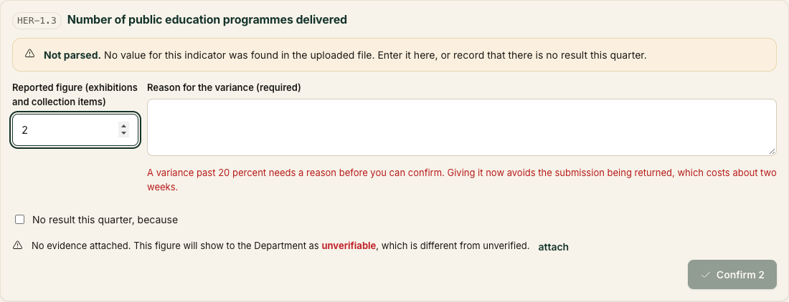

Give the reason now. A shortfall without one is the most common reason the Department returns a
submission, and a return costs about two weeks.

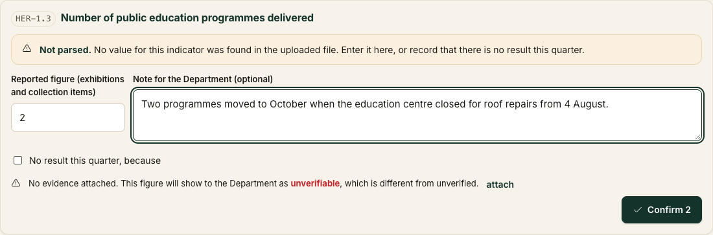

**A value that is not a number.** The cell held text such as "approx 8". The row says **Not a
number** and shows the text. Type the number into **Reported figure**, or record no result with a
reason, as above.

## 5. Attach evidence

Evidence is what lets the Department trace a figure back to a source document, which is the
Auditor-General's reliability test.

1. Click **attach** on the row.
2. Click **Choose file** and pick the document (1).
3. Tick which part of the reliability test it satisfies (2): **Validity** (it happened and relates
   to your entity), **Accuracy** (amounts and quantities are right), **Completeness** (everything
   that should have been recorded was).
4. Click **Attach** (3).

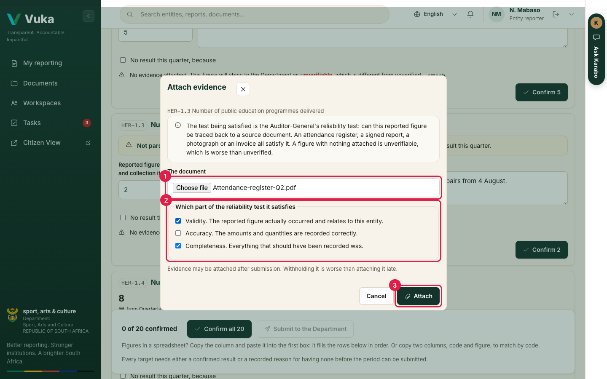

The document now shows under the figure with a green shield, and the parts of the test it
satisfies.

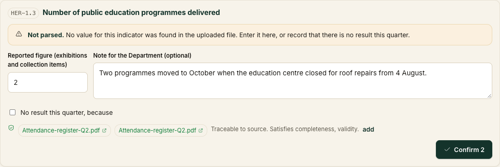

To attach several files at once, use **Attach evidence files** at the top of the page.

You can attach evidence after you submit, too. Withholding it is worse than attaching it late. A
figure with nothing attached shows to the Department as **unverifiable**.

## 6. Confirm your figures

Confirm one row at a time with its **Confirm** button, or every row that is ready at once with the
button at the bottom of the page (1). That button reads **Confirm all *n*** while every outstanding
row is ready, and **Confirm *n* ready** while some still need a figure or a reason.

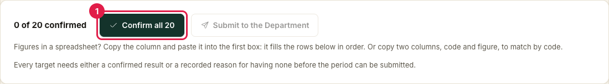

Only one of the two buttons at the bottom is the next step at any moment, and it is the highlighted
one. While figures are outstanding, that is the bulk confirm. Once nothing is outstanding, it
becomes **Submit to the Department**.

Vuka shows every figure you are about to confirm, with the cell it came from. A figure you typed
in yourself says **entered by hand**.

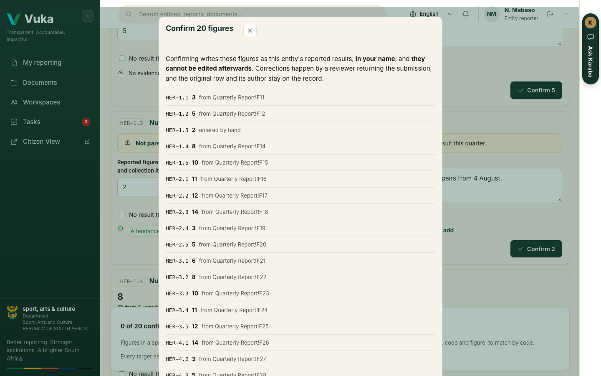

Read the first paragraph before you click **Confirm**. Confirming writes these figures as your
entity's reported results, **in your name**, and **they cannot be edited afterwards**. If one is
wrong, the Department returns it and you confirm a corrected figure. The original stays on the
record.

## 7. Submit to the Department

When every target has a confirmed figure or a recorded reason for having none, **Submit to the
Department** (1) turns on.

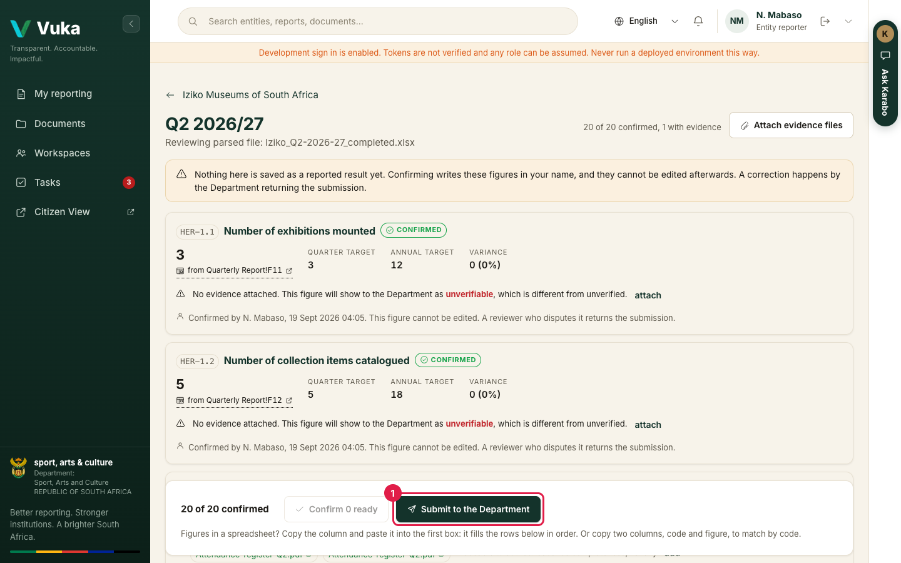

Click it. Vuka summarises what you are sending: how many targets, how many with a result, how many
with no result and a reason, how many with evidence and how many without, and how many days before
or after the due date you are.

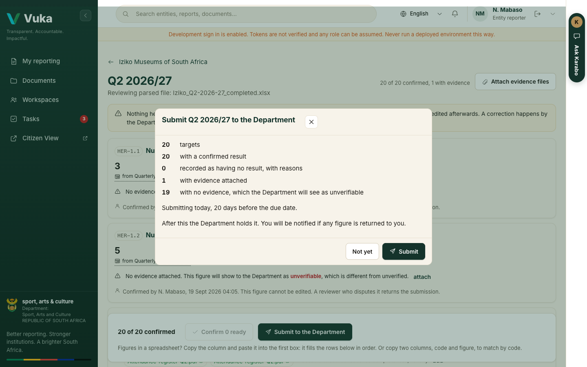

Click **Submit**.

## 8. After you submit

Your home page now says **The Department holds it**. The Department is looking at it, and you will
be told if any figure comes back to you. You can still attach evidence.

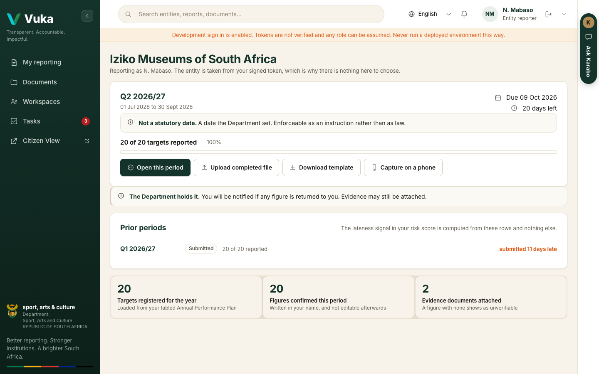

---

## If a figure is returned to you

A reviewer who disputes a figure returns it with a comment against that figure. Only the disputed
figures are reopened. Everything else stays as you filed it.

A returned quarter sits at the top of your home page, whichever quarter it is: who returned it,
when, and each disputed figure with the reviewer's comment in their words. It appears without
reloading the page. Click **Answer the disputed figure** (1).

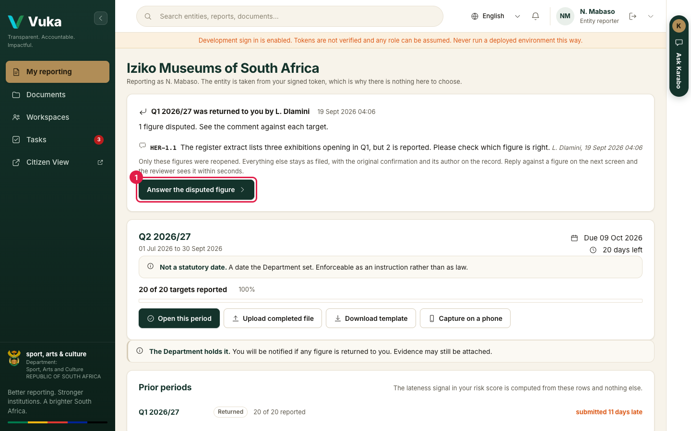

The disputed figure opens with the Department's comment above it. Correct the figure or explain it
in the note, attach evidence if you have it, confirm it, and submit again. **Show all 20 figures**
shows the rest of the filing if you need it.

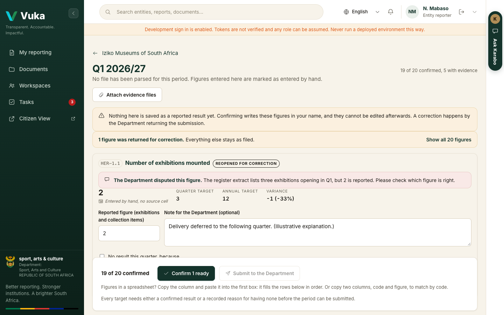

---

Next: [J2. Reporting from a phone](J2-reporting-from-a-phone.md)
