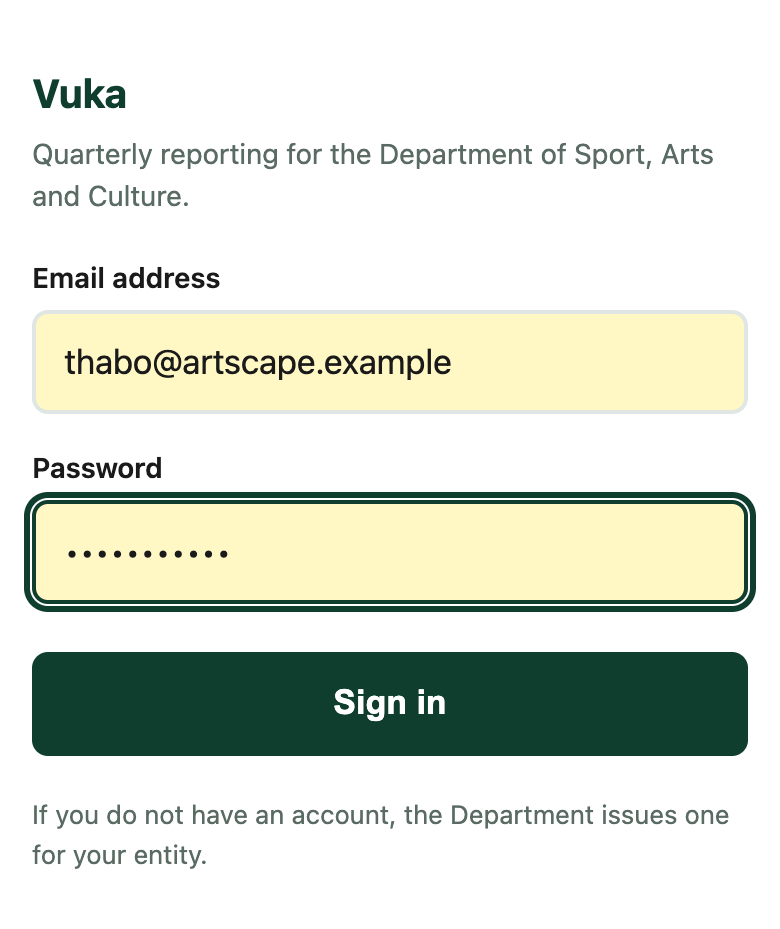
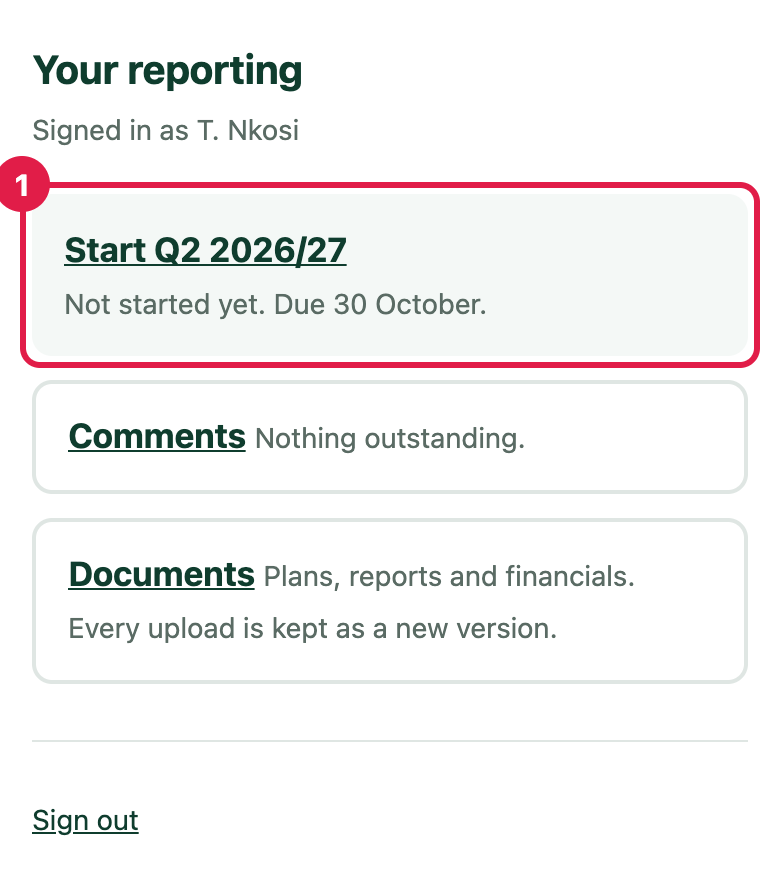
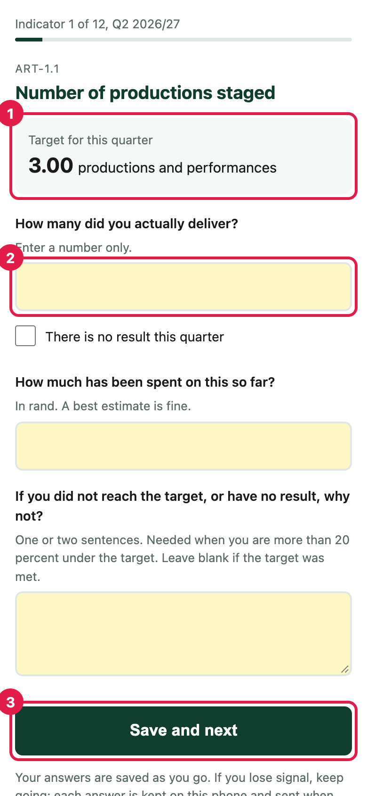
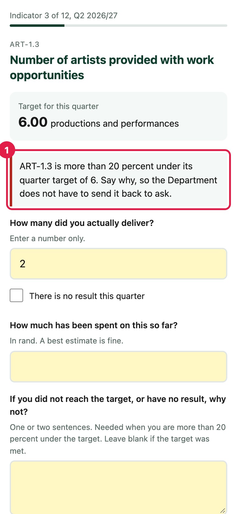
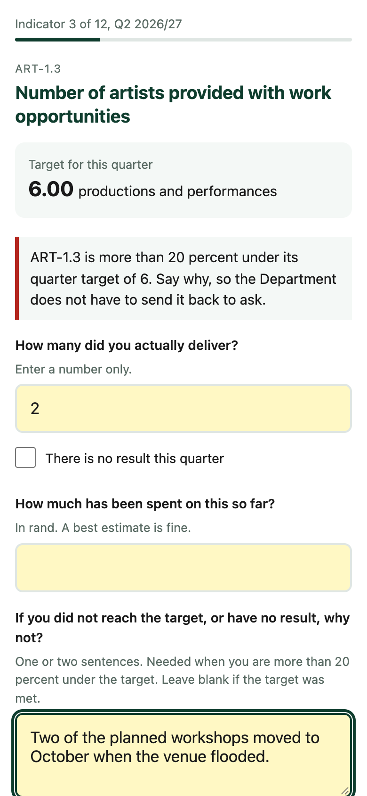
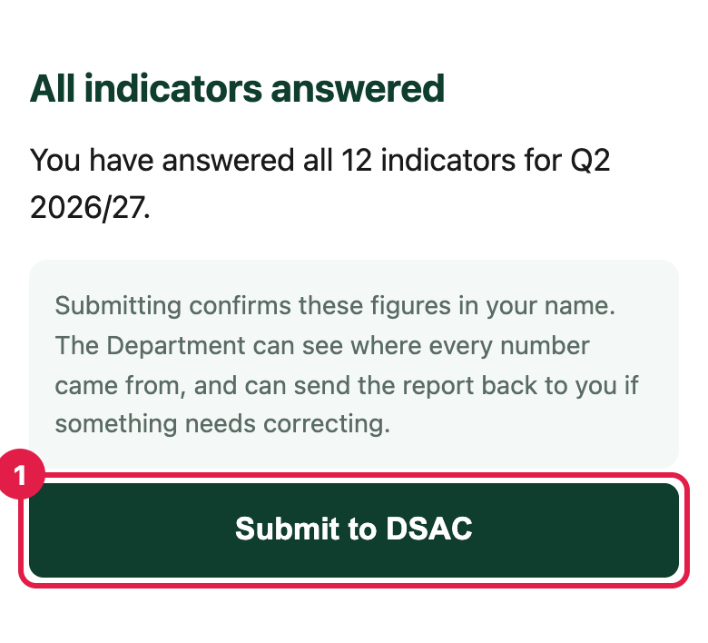
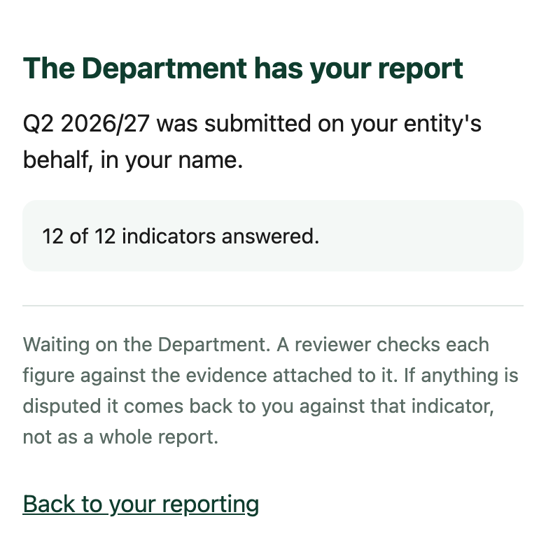
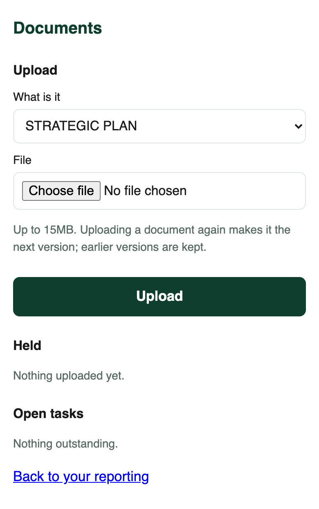

# J2. Reporting from a phone

[Back to the manual](README.md)

**Who this is for:** the person at a small entity who reports on a phone, often on mobile data,
and is not a finance specialist.

**What you will do:** sign in, answer one indicator at a time, and submit.

The phone pages are deliberately plain. They load quickly on a weak signal and use very little
data. Your answers are saved as you go, so a dropped connection never loses your work.

---

## 1. Open the link and sign in

Open the link DSAC sent you (it ends in `/m`). Enter your email address and password, and tap
**Sign in**.

If you do not have an account, DSAC issues one for your entity. You cannot sign up yourself.

A sign-in lasts about an hour. If it runs out part way through, sign in again and Vuka takes you
back to the question you were on.

## 2. Start the quarter

**Your reporting** shows the open quarter and when it is due. Tap **Start Q2 2026/27** (1). Once
started, the same card lets you continue where you left off.

**Comments** shows anything the Department has asked you. **Documents** is where you upload plans,
reports and evidence (step 6).

## 3. Answer one indicator at a time

Each indicator has its own page. The bar at the top shows how far through you are.

1. What the Department expected this quarter.
2. **How many did you actually deliver?** Enter a number only. If there is nothing to report,
   tick **There is no result this quarter** instead.
3. Tap **Save and next**.

Two more fields are on each page:

- **How much has been spent on this so far?** In rand. A best estimate is fine.
- **If you did not reach the target, or have no result, why not?** One or two sentences.

## 4. If you are well under the target, say why

If your figure is more than 20 percent under the quarter target and you have not said why, Vuka
keeps you on that page and asks (1).

Write a sentence in the **why not?** box and tap **Save and next** again. Saying why now means the
Department does not have to send it back to ask.

## 5. If you lose signal

Keep going. Each answer is kept on the phone and sent when the signal comes back. The page tells
you how many are waiting.

If you close the page, open the same link again. The question number is part of the page address,
so you return to the question you were on, with your earlier answers still there.

## 6. Submit

After the last indicator, Vuka says **All indicators answered**. Tap **Submit to DSAC** (1).

Submitting confirms these figures in your name. The Department can see where every number came
from, and can send the report back if something needs correcting.

You then see **The Department has your report**. There is no need to submit twice.

If the Department disputes anything, it comes back to you against that one indicator, not as a
whole report. You will find it under **Comments**.

## Uploading evidence and documents

From **Your reporting**, tap **Documents**.

1. Choose what the document is under **What is it**.
2. Tap **Choose file** and pick it (up to 15MB).
3. Tap **Upload**.

Uploading the same document again makes it the next version. Earlier versions are kept. Every
upload gets a receipt number, so you can prove what you sent and when. **A receipt is not an
approval**: the Department approves or rejects each document separately.

---

Next: [J3. Reviewing submissions](J3-reviewing-submissions.md)
