# J3. Reviewing submissions

[Back to the manual](README.md)

> **In short:** Start with the entities most at risk. Check each figure against its evidence. Approve the
> submission, or send back only the figures you doubt, with a reason. Nobody can edit a figure.

**Who this is for:** the DSAC reviewer who checks what the entities submit.

**What you will do:** decide which entities to look at first, see why each is ranked where it is,
check the figures against their evidence, return the ones you dispute, and approve the rest.

There is no control anywhere in Vuka that changes a reported figure. A figure you do not believe is
disputed and returned, never edited.

---

## 1. Start from Today

Sign in. You land on **Today**, which answers one question: what to look at first.

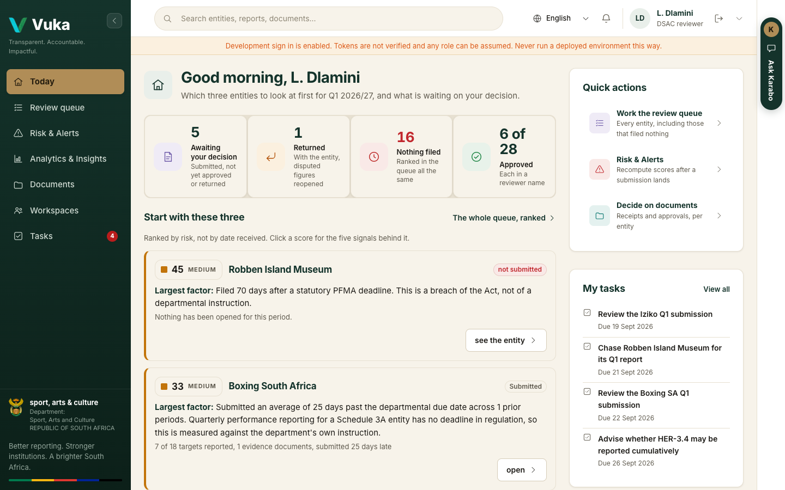

- The four counts across the top: submissions **awaiting your decision**, **returned** to an
  entity, entities that have **filed nothing**, and how many are **approved**.
- **Start with these three**: the three entities at the top of the risk ranking, each with its
  **Largest factor** in words.
- **Quick actions** on the right: the review queue, Risk & Alerts, and deciding on documents.
- **My tasks** under them: work set for you, with due dates. See
  [Working together](working-together.md#2-tasks).

Click **The whole queue, ranked** or **Review queue** in the menu to see every entity.

## 2. Work the review queue

The queue lists every entity for the quarter under review, **ranked by risk, not by date
received**, so the ones that most need attention are at the top.

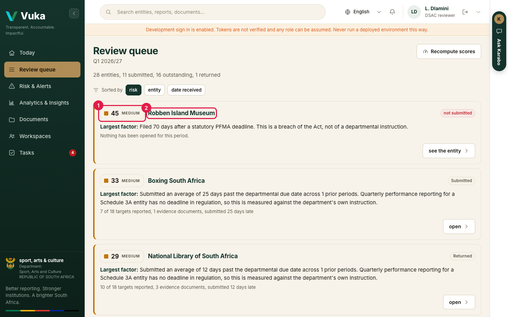

1. The risk score and band. Colour is never the only signal: the number and the band word are
   always shown.
2. The entity, with its status (**Submitted**, **Returned**, **Approved** or **not submitted**),
   its **Largest factor**, and how many figures and evidence documents it filed and how late.

You can re-sort by **entity** or **date received**, but risk order is what makes the queue
readable. Click **show all** at the bottom to list every entity.

After a submission lands, click **Recompute scores** to bring the ranking up to date.

## 3. Ask why an entity is ranked where it is

Click the score. A panel shows all five signals behind it, each with its weight, what it
contributes to the total and a sentence explaining it.

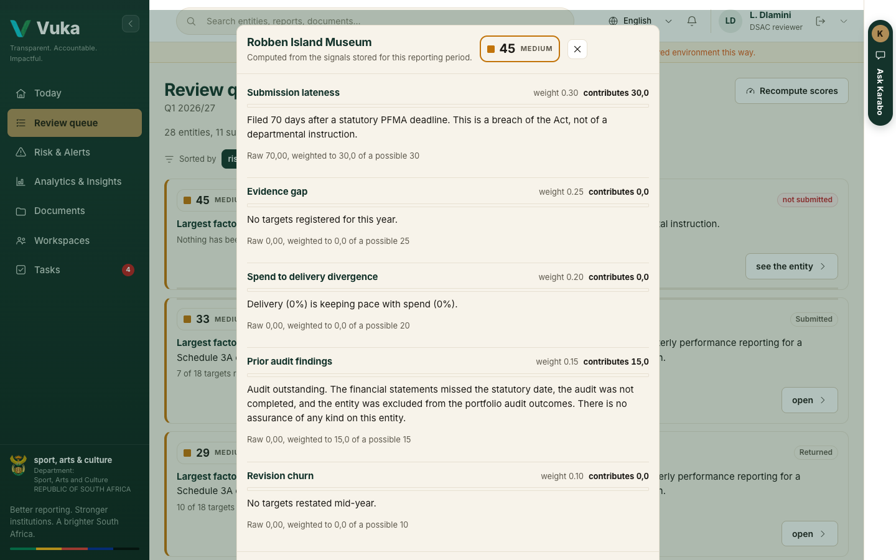

The five signals are submission lateness, evidence gap, spend running ahead of delivery, prior
audit findings, and targets restated mid-year. Every score is arithmetic from those signals, not a
prediction, and can be reproduced by hand. The executive sees exactly the same explanation.

## 4. Open a submission

Click **open** on the entity's row (1).

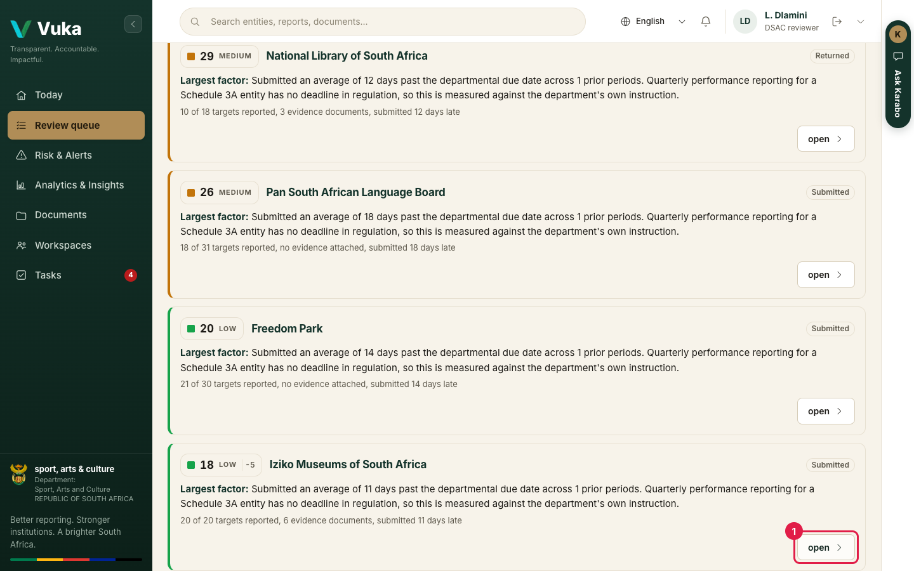

The submission opens with who submitted it, when, how late, and how many figures have evidence.
Every figure sits beside its source cell or says **Entered by hand**, with the entity's own
explanation and its evidence documents. Click a document to open it without leaving the page.

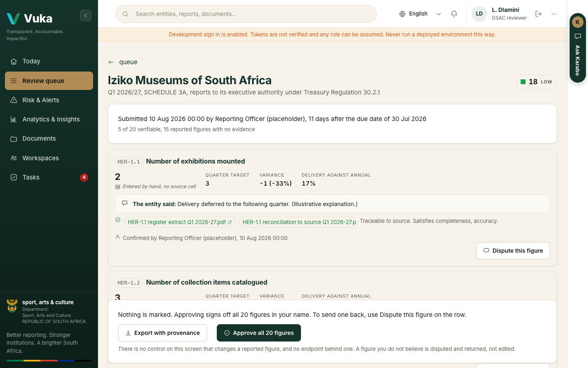

## 5. Dispute a figure you do not believe

1. Click **Dispute this figure** on that figure.
2. Write the reason. The entity sees it against this target only, so say exactly what is wrong.
3. Click **Mark disputed** (1).

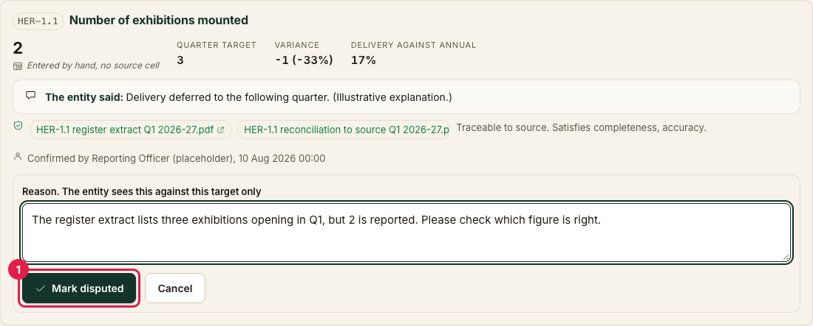

The box closes and the figure now carries a **DISPUTED** label with your reason read back
underneath it, so you can see at a glance what will be sent. **Nothing has gone to the entity
yet.** Two buttons sit under the reason:

- **Edit the reason** reopens the box with what you wrote.
- **Undo this dispute** takes the mark off entirely.

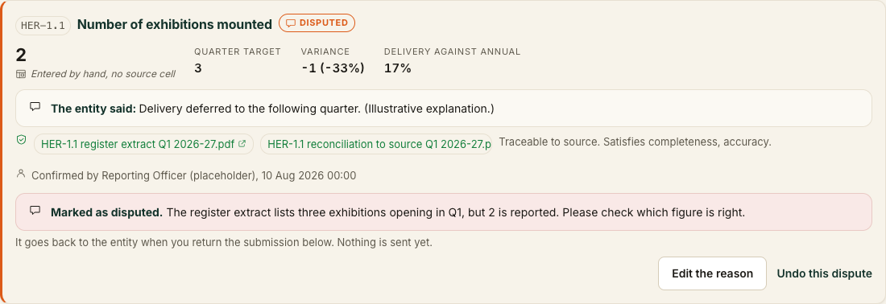

Dispute as many figures as you need to before you return the submission. A figure that was
disputed on an earlier round and is already with the entity says so and offers no undo: that one
has left your hands.

## 6. Return, or approve

The bar at the bottom of the page says, in a sentence, what you have marked so far and what its one
button will do.

While **nothing is marked**, the button is **Approve all *n* figures**:

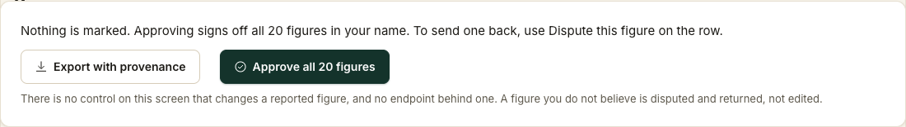

As soon as **anything is marked**, it becomes **Return *n* figures to the entity** (1):

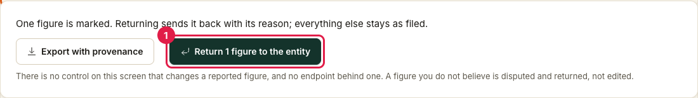

**Export with provenance** downloads the filing with the source of every figure.

### Returning

Click **Return *n* figures to the entity**. Vuka lists each disputed figure with your comment. Add
an overall note if it helps, then click **Return 1 figure** (or however many you disputed).

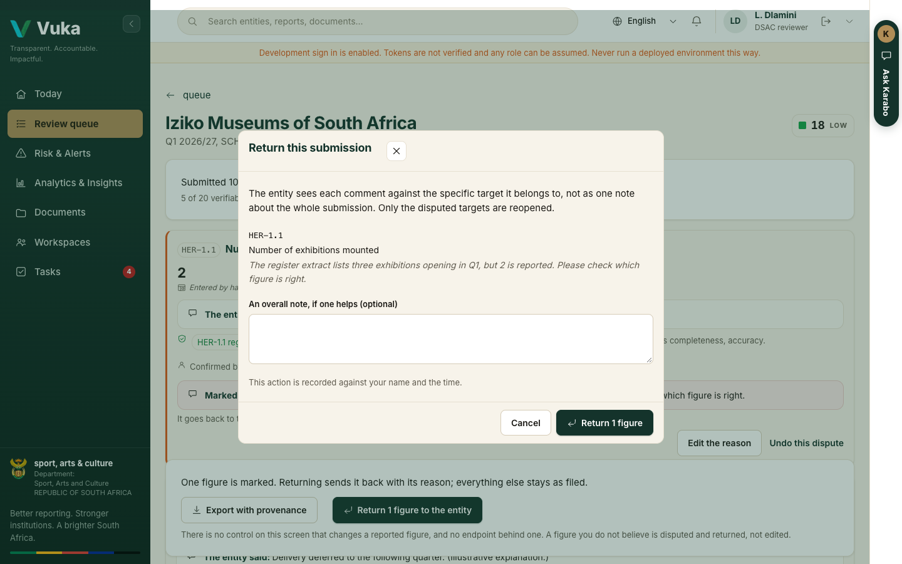

The rest of the submission stays as filed, with its original confirmation and author. The reporter
sees your comment against that figure on their home page (see
[If a figure is returned to you](J1-reporting-from-your-desk.md#if-a-figure-is-returned-to-you)).

You go back to the queue, where a line at the top confirms what was recorded.

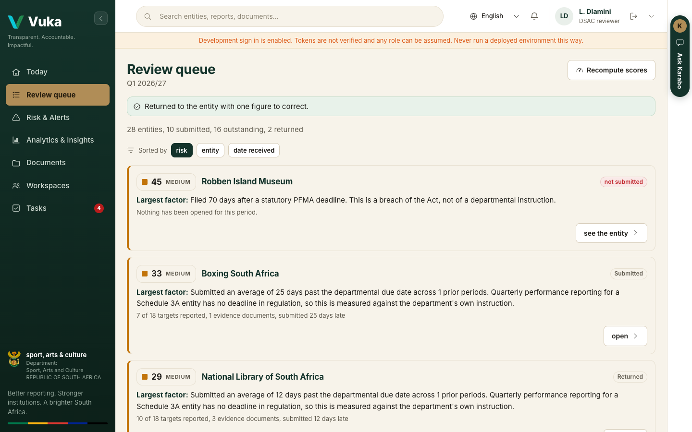

### Approving

Open a submission you are satisfied with and click **Approve all *n* figures**. The dialog warns
you how many figures have no evidence: they stay on the record as unverifiable, and approving does
not change that. Click **Approve** to confirm.

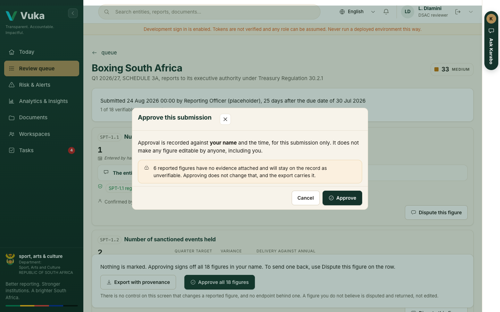

Approval is recorded with your name and the time, one submission at a time. There is no bulk
approval. Back in the queue, the line at the top confirms it and the entity's row reads
**Approved**.

With no connection, a return or an approval waits in the outbox and the line says so. It goes as
soon as there is a connection, and your disputes and the return go together and in order. See
[Working together](working-together.md#6-working-without-a-connection).

## 7. Risk & Alerts

**Risk & Alerts** in the menu is the early warning view across all 28 entities: how many are in
each band (critical 70 or above, high 50 to 69, medium 25 to 49, low below 25), then every entity
with its band, its largest contributing factor, its score and whether it has reported.

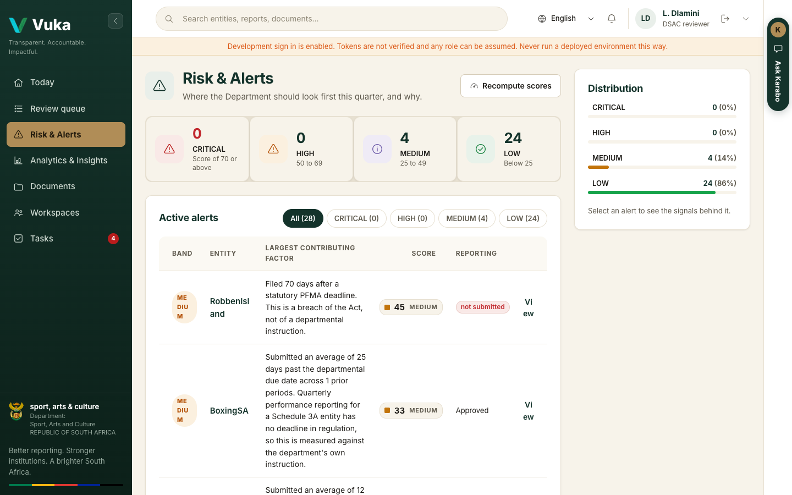

Filter by band with the buttons above the table. Click **View** on a row, or the score, for the
signals behind it. The weights and band limits are fixed and published at the foot of the page.

---

Next: [J4. The portfolio view](J4-portfolio-view.md)
