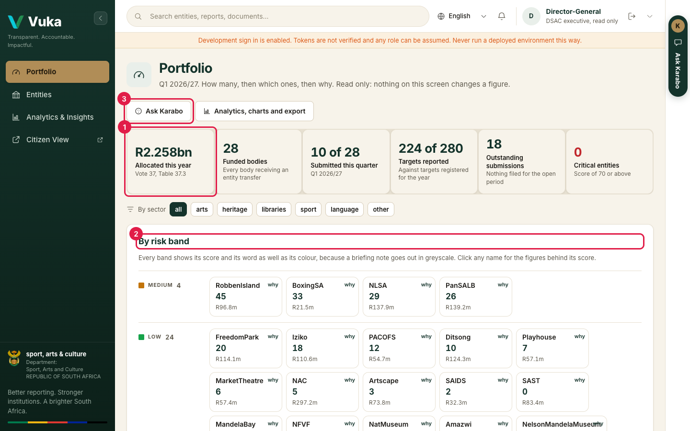
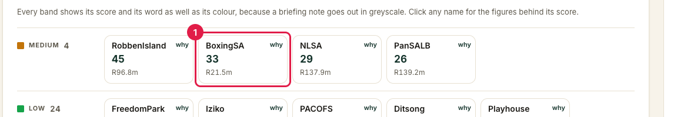
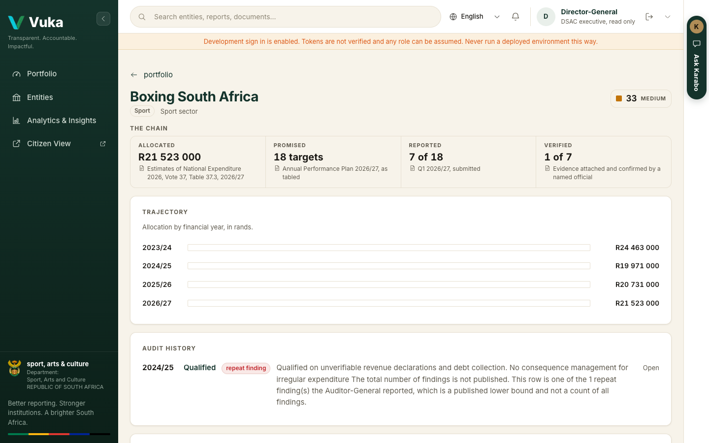
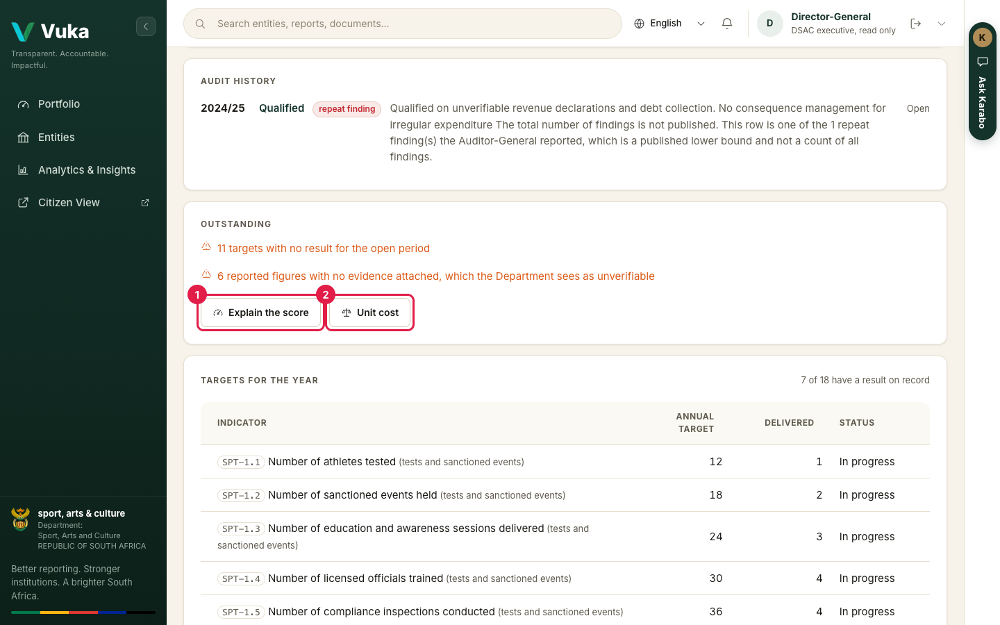
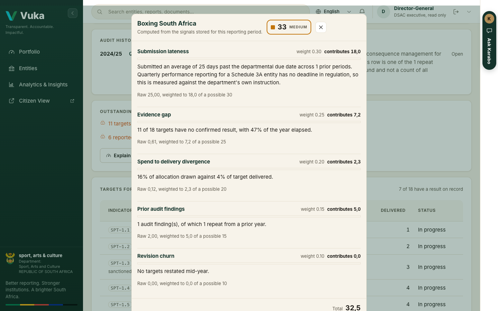
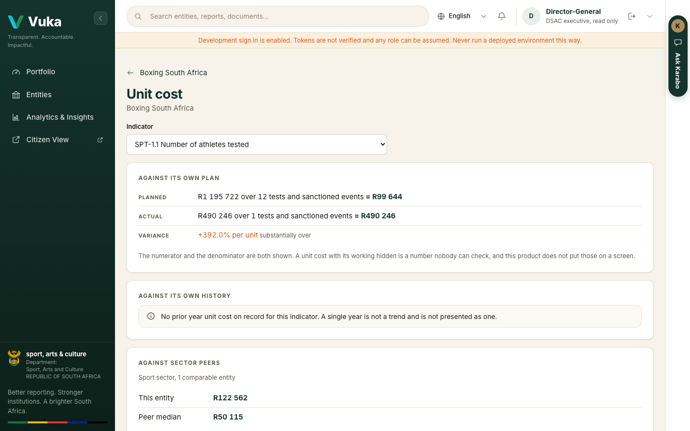
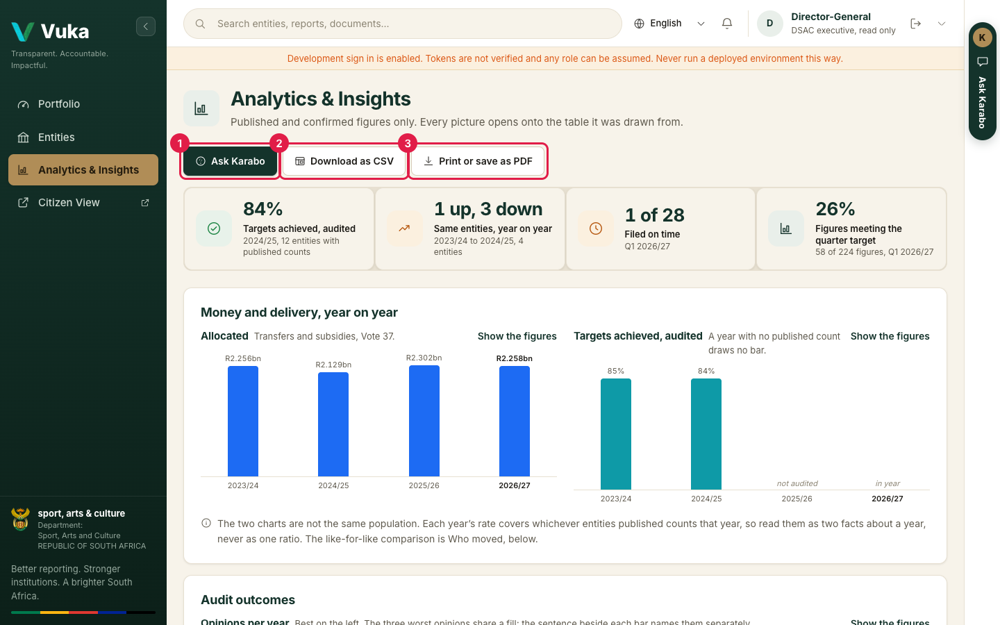

# J4. The portfolio view

[Back to the manual](README.md)

> **In short:** See all 28 entities on one page, open any one to see why it scores as it does, follow the trends
> over the years, and ask Karabo. Nothing on these screens changes a figure.

**Who this is for:** the Director-General and other DSAC executives who need the whole portfolio at
a glance and must be able to explain any one entity, for example before a portfolio committee
meeting.

**What you will do:** read the portfolio totals, find the entities that need attention, open one,
see why it scores as it does, and look at what it costs to deliver.

This view is read only. Nothing on these screens changes a figure.

---

## 1. Read the portfolio

Sign in. You land on **Portfolio**, for the quarter under review.

1. The totals across the top, starting with the allocation: the rands **allocated this year**, the **funded bodies**, how many
   **submitted this quarter**, **targets reported** against those registered, **outstanding
   submissions**, and **critical entities** (a score of 70 or above).
2. **By risk band**: every entity, grouped by band, with its score and its allocation. Use **By
   sector** to narrow it to arts, heritage, libraries, sport or language.
3. **Ask Karabo**, to ask a question in ordinary words (step 6). **Analytics, charts and export**
   beside it opens step 5.

The allocations are the published figures from the Estimates of National Expenditure 2026, Vote
37, Table 37.3.

## 2. Open an entity

Click an entity's name (1). Click **why** in its corner for the score explanation straight away.

The entity page follows the accountability chain from left to right: what it was **allocated**,
what it **promised** (targets in its Annual Performance Plan), what it **reported**, and how much
of that is **verified** with evidence. Each figure names the document it comes from. Under it are the allocation by year and its audit history
from the Auditor-General.

Further down, **Outstanding** lists targets with no result and figures with no evidence, and
**Targets for the year** shows every target with what has been delivered.

## 3. See why it scores as it does

Click **Explain the score** (1). **Unit cost** (2) is for step 4.

The panel shows each of the five signals with its weight, its contribution and a sentence. It is
the same explanation the reviewer sees, so the Department always gives one account of the same
fact.

## 4. Ask what it costs

Click **Unit cost** and pick an **Indicator**. Vuka compares cost per unit delivered three ways:

- **Against its own plan**: planned spend over planned units, beside actual spend over actual
  units. Both the numerator and the denominator are shown so anyone can check the sum.
- **Against its own history**: the same indicator in earlier years, where there is a record.
- **Against sector peers**: only other entities in the same sector, and only where a peer group
  exists.

Vuka does **not** compare cost per outcome across sectors. A library item and a boxing licence are
not comparable outputs, so there is no screen that does it.

## 5. Is the portfolio getting better?

Click **Analytics & Insights** in the menu. Four headline measures across the top, then the portfolio drawn
rather than tabulated:

- **Money and delivery, year on year.** Two charts side by side: what was allocated each year, and
  the share of targets the Auditor-General recorded as achieved. They are two charts rather than
  one because putting rands and a percentage on the same picture is the most common way a chart
  misleads.
- **Audit outcomes.** One bar per year, best opinions on the left, with the counts written out
  beside each bar.
- **Filing.** Who filed on time, who was late and who has not filed, quarter by quarter, beside the
  share of figures that met their quarter target.
- **By sector.** Rands and delivery side by side, never divided into one another.
- **Who moved.** One row per entity, showing where it was in the earlier audited year and where it
  is now, across only the entities with published counts in both years.

A year the Auditor-General has not yet audited draws **no bar** and says why. It never draws a bar
of zero.

Every chart has **Show the figures** beside it, which opens the exact table it was drawn from.
That is the table to quote from: the picture is for the glance, the table is the record.

## 6. Ask a question in the meeting

Click **Ask Karabo** at the top of Analytics or the Portfolio. Karabo opens beside the page. Click a
suggested question or type your own, for example *Why is Robben Island scored critical?*

The answer gives the figure, the reasons, and underneath, **where this came from**. Here Karabo
also corrects the question: Robben Island is medium, not critical. Follow up in the same
conversation, for example *How is Iziko doing this quarter?*

Karabo answers only from Vuka's records, with your own access, so it tells an executive nothing the
Portfolio would not. If the record does not hold the answer it says so rather than guessing. It can
still be wrong, which is why the source is under every answer: a figure quoted in a portfolio
committee has to be defensible. More in [Asking Karabo](karabo.md).

## Taking it to a meeting

Two buttons at the top of **Analytics**:

- **Download as CSV** saves the whole view (years, quarters, sectors, movement and the sources)
  as one spreadsheet, headed in the language you have chosen. A blank cell means *not published* or *not yet due*, and the file says so on
  its fifth line. It never means zero.
- **Print or save as PDF** lays the screen out as a committee pack: the menu and the buttons come
  off, the charts keep their fill, and nothing carrying a figure breaks across a page.

To take a single entity's figures on paper, open its page and use your browser's **Print** (Ctrl+P,
or Cmd+P on a Mac). The risk bands carry their score and band word as well as their colour, so they
still read correctly in greyscale.

---

Next: [J5. The citizen view](J5-citizen-view.md)
