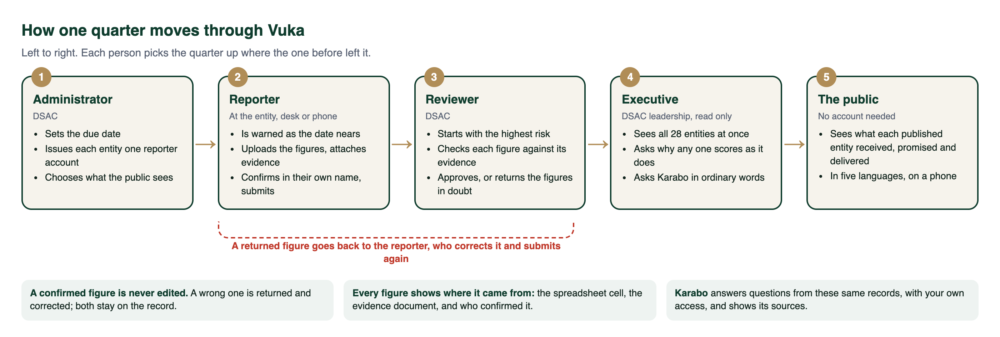
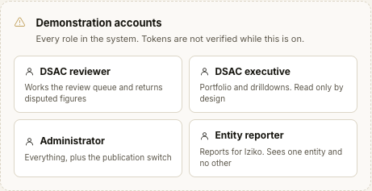

# Vuka user manual

## Vuka in one minute

The Department of Sport, Arts and Culture (DSAC) funds 28 public bodies: museums, theatres, arts
councils, libraries, sport and language bodies. Every quarter each of them must tell the Department
what it achieved against the targets it promised. Vuka is where that happens.

- **Entities report** their figures, and attach the document each figure came from.
- **The Department checks** them, starting with the entities most at risk, and approves them or
  sends back the ones it doubts.
- **Leadership sees** the whole portfolio at a glance, and can ask questions in ordinary words.
- **The public sees** what each published body was given and what it delivered.

---

## The five journeys

Each chapter follows one person from signing in to finishing their work, without stopping to show
anyone else's screen. They are in the order the demonstration plays them.

| # | Person | What they do | Chapter |
|---|---|---|---|
| 1 | **Administrator** (DSAC) | Brings the Q2 deadline forward, gives Artscape a reporter account, publishes entities to the public | [The administrator](1-administrator.md) |
| 2 | **Reviewer** (DSAC) | Works the Q1 queue by risk, sends one of Iziko's figures back, approves Boxing South Africa | [The reviewer](2-reviewer.md) |
| 3 | **Reporter** (Iziko Museums) | Is warned about Q2, answers the figure the reviewer sent back, then files Q2 from the template | [The reporter](3-reporter.md) |
| 4 | **Executive** (DSAC leadership) | Reads the portfolio, explains one entity's score, looks at the trends, asks Karabo | [The executive](4-executive.md) |
| 5 | **The public** | Finds an entity, reads its record in their language, asks Karabo | [The public](5-public.md) |

Why the reviewer comes before the reporter: the entities filed Q1 in August, so on the day of the
demonstration the reviewer is working through those filings while Q2 is still open. Doing the
review first means the reporter signs in once and meets everything waiting for them in one sitting.

The script for presenting it is [Demonstration script](demo-script.md).

---

## Words you will see

| Word | What it means |
|---|---|
| **Entity** | One of the 28 bodies DSAC funds, for example Iziko Museums or Boxing South Africa |
| **Quarter** | A three-month reporting period. Q1 is April to June, Q2 is July to September |
| **Target** | Something the entity promised to deliver this year, for example "12 exhibitions mounted" |
| **Figure** | What the entity says it actually delivered against a target this quarter |
| **Evidence** | The document behind a figure: an attendance register, a signed report, an invoice |
| **Confirm** | The reporter's promise that a figure is right. It is recorded in their name and cannot be edited |
| **Submit** | Sending the whole quarter to the Department |
| **Return** | The Department sending back one or more figures it doubts, with a reason |
| **Unverifiable** | A figure with no evidence attached. It cannot be checked at all |
| **Risk score** | A number from 0 to 100 saying how much attention an entity needs. Always explained, never a black box |
| **Published** | Visible to the public. Nothing is public until the Department publishes it |
| **Karabo** | The assistant. Ask it a question and it answers from Vuka's records, with its sources |

---

## Signing in

Open the Vuka address. The landing page offers **Sign in** (1). The **Ask Karabo** tab (2) is on the
right edge of every page, before and after signing in.

On a real deployment each person signs in with the email address and password DSAC issued them.
There is no sign-up. In the demonstration copy, the sign-in page also has a **Demonstration
accounts** panel under the form. Click a role to sign in as that person.

Every signed-in page has a **language** picker at the top (English, Afrikaans, isiZulu, isiXhosa,
Sesotho) and a menu down the left that holds only what that person can use.

---

## About the screenshots

The screenshots were taken on the demonstration copy, in the order of this manual, so each screen
shows what the journey before it left behind. The 28 entities and their allocations are real,
from the Estimates of National Expenditure 2026, Vote 37. Quarterly figures, comments and people's
names are illustrative.

Two things in them appear only in the demonstration copy: the orange strip reading "Development
sign in is enabled", and the Demonstration accounts panel.

Karabo's answers are real answers from the connected model. Asked again, it may word them
differently; the figures and sources stay the same.

Red numbered boxes were added to show where to click. They are not part of the screen.
