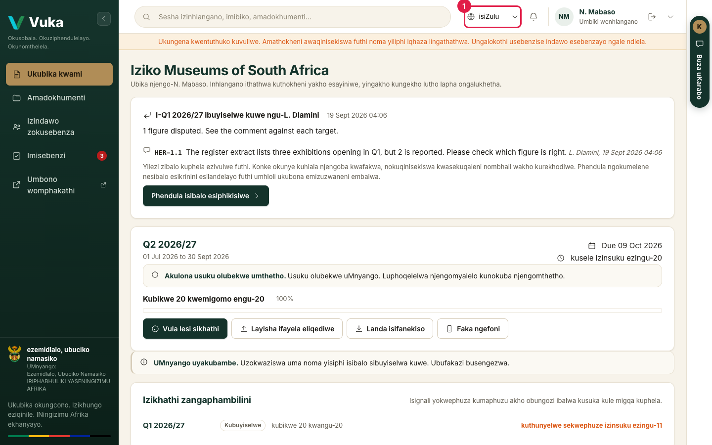
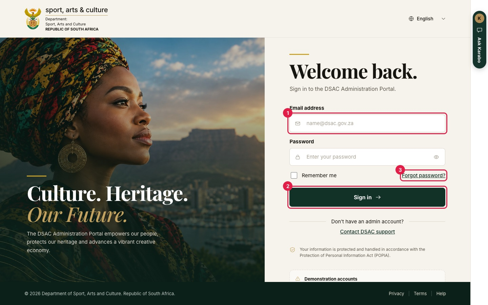
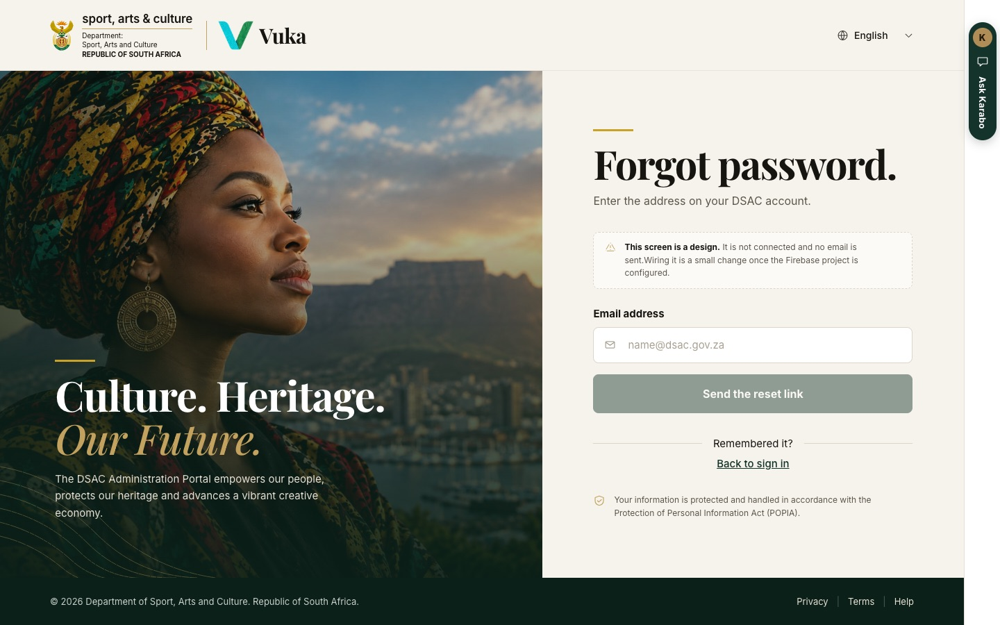
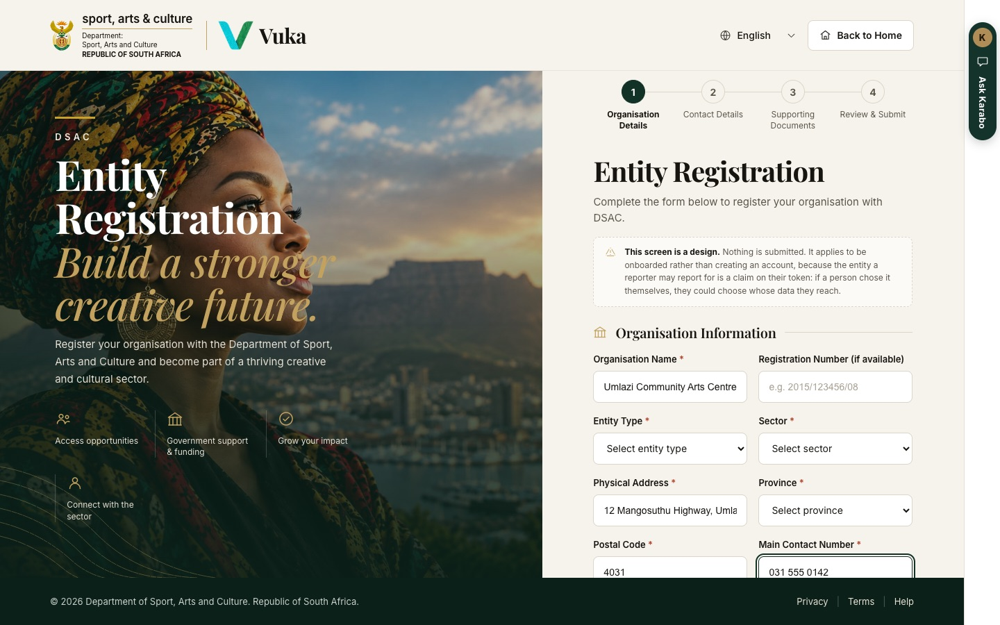

# Getting in

[Back to the manual](README.md)

> **In short:** Open the Vuka address, pick your language, and sign in with the account DSAC gave you. There is
> no sign-up. Karabo, the assistant, is on the right edge of every page.

**Who this is for:** anyone opening Vuka for the first time.

**What you will do:** find your way in from the landing page, choose your language, and sign in.

---

## 1. The landing page

Open the Vuka address. Before you sign in you see the Department's landing page.

1. **Login as employee.** For DSAC staff, by single sign-on, straight to the dashboard.
2. **Sign in.** For reporting entities, who sign in with the account DSAC issued them.
3. **Language.** English, Afrikaans, isiZulu, isiXhosa or Sesotho. **Citizen View** beside it
   opens the public pages, no account needed.
4. **Ask Karabo**, the assistant (see step 4).

In this demonstration build **Login as employee** signs in with the administrator role. Federated
sign-in through the Department's Microsoft Entra ID is not wired, and the note under the two cards
says so.

## 2. Choose your language

Pick your language from the picker at the top of any page, before or after you sign in. The whole
dashboard follows it: menus, buttons, headings, messages and dialogs.

Vuka remembers your choice on that computer. Numbers, dates and rands are written the South African
way in every language.

Three things to know:

- The four translations were drafted by machine and have **not yet been reviewed** by first-language
  speakers. Where a word matters, the English is the reference.
- A few error messages, and the descriptions of changes waiting to be sent while you are offline,
  still appear in English whatever language you choose.
- Terms with a legal or audit meaning (**unverifiable**, **statutory**, **no result reported**) are
  kept distinct in every language, because the difference between them is the point.

## 3. Sign in

Click **Sign in** on the landing page.

1. Enter the email address on your account and your password.
2. Click **Sign in**.
3. **Forgot password?** opens the reset page.

DSAC staff signing in by single sign-on use the landing page's **Login as employee** card; the
sign-in page itself has only the email and password form.

The notice under the form says how your personal information (your email address and password) is
handled under the Protection of Personal Information Act. In the demonstration build a
**Demonstration accounts** panel sits below it, with one button per role; scroll the form to reach
it.

**Forgot password** asks for your email address. In this build the page is a design: it is not
connected and **no email is sent**, and the page says so. It answers in the same words whether or
not the address has an account, so the page cannot be used to find out who has one.

## 4. Ask Karabo

The **Ask Karabo** tab on the right edge of every page opens **Karabo**, the assistant. Ask it a
question in ordinary words and it answers from Vuka's records, with the source under each answer.
Before you sign in it can only tell you what the Department has published.

See [Asking Karabo](karabo.md) for what it can answer and for whom.

## 5. An entity that has no account yet

There is no sign-up. A reporter's account is tied to one entity, and that tie is what stops one
entity reading another's reporting, so accounts are issued by a DSAC administrator (see
[Setting up](00-administrator.md#3-issue-a-reporter-account)).

The **Entity Registration** page, at the address followed by `/register`, is where an organisation
would apply to be onboarded. It collects organisation details, contact details and supporting
documents over four steps, and it creates no account. **In this build it is a design and nothing
is submitted.** The notice at the top of the form says so.

---

Next: [Setting up: the administrator](00-administrator.md)
