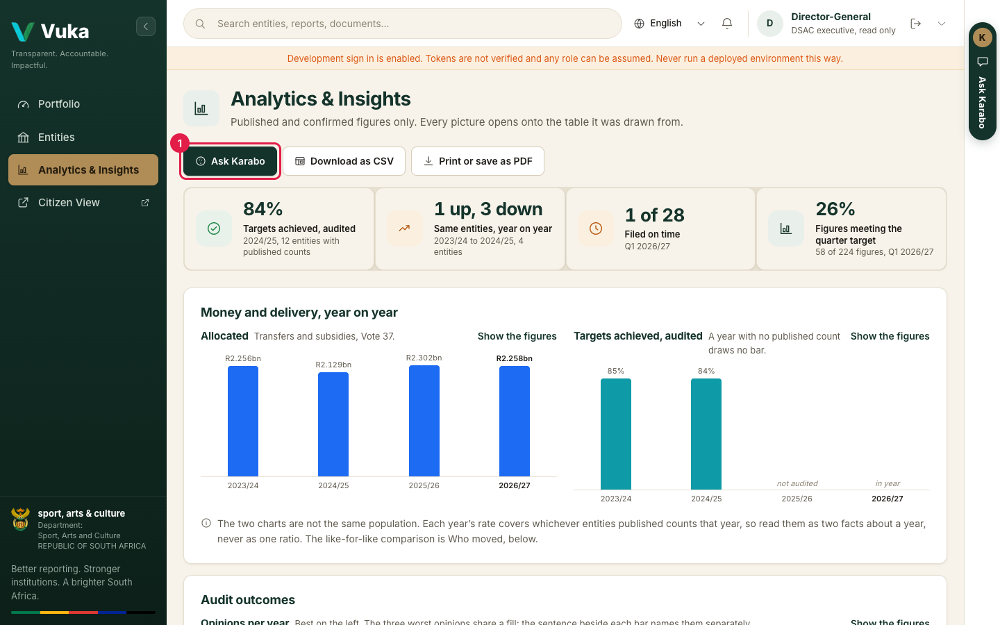
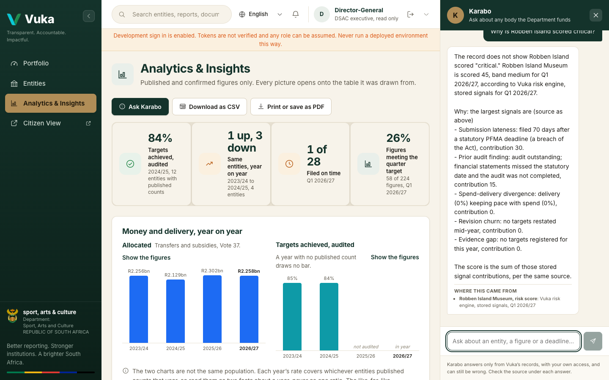
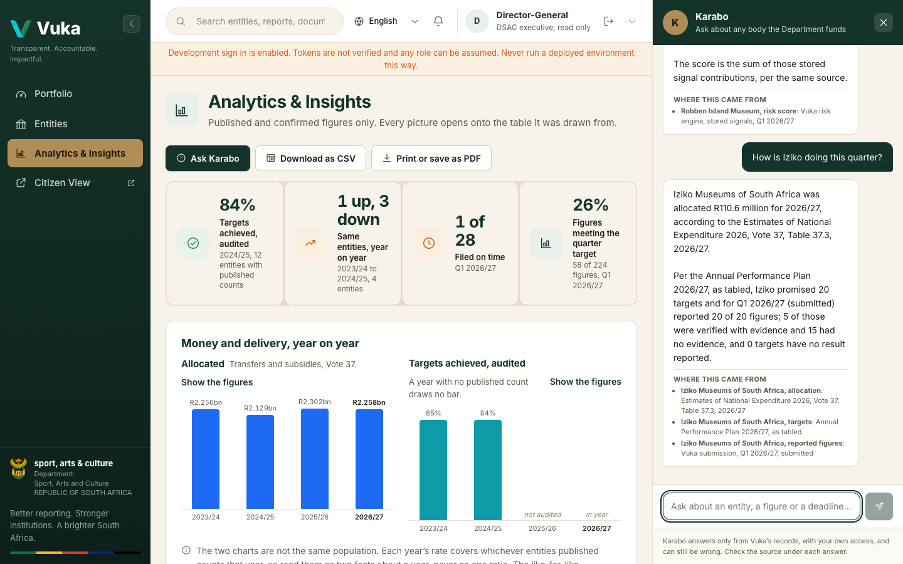
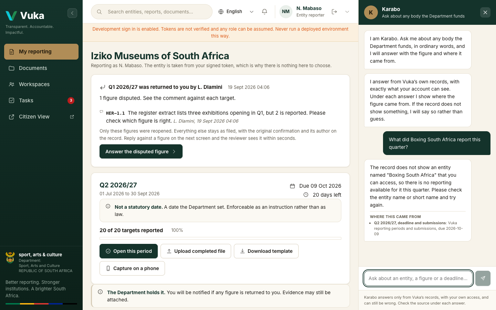
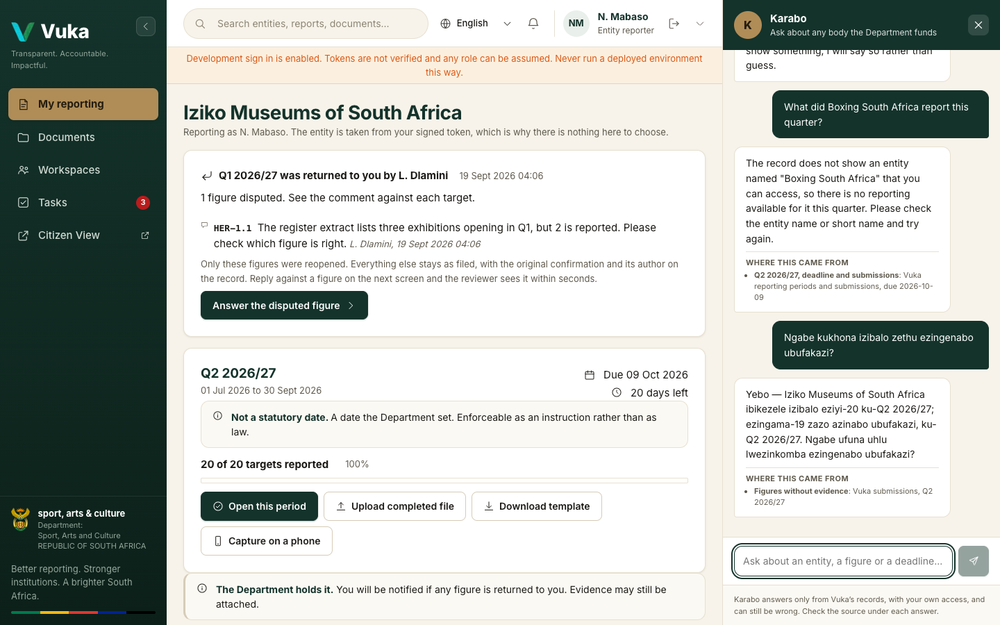

# Asking Karabo

[Back to the manual](README.md)

> **In short:** Karabo is Vuka's assistant. Ask it a question in ordinary words, in any of the five
> languages, and it answers from Vuka's own records. Under every answer it lists where the figure
> came from. It only ever tells you what your own account is allowed to see.

---

## 1. Open Karabo

Click the **Ask Karabo** tab on the right edge of any page. It is there before you sign in, on the
landing page, and on every screen after. On **Portfolio** and **Analytics & Insights** there is also
an **Ask Karabo** button at the top (1).

Karabo opens beside the page, and the page moves over to make room, so nothing is covered. The
opening message says what it can answer for you. Four suggested questions sit above the box:

- *Which entities are late this quarter?*
- *What was Iziko allocated this year?*
- *Why is Robben Island scored critical?*
- *Show me figures with no evidence attached*

Click one, or type your own question in the box at the bottom and press enter. Close Karabo with
the **X** at its top right.

## 2. Read the answer

Every answer has two parts:

1. **The answer**, in a sentence or a short list.
2. **Where this came from**, underneath: the records Vuka actually read to produce it, for example
   *Estimates of National Expenditure 2026, Vote 37, Table 37.3*. These are collected by Vuka from
   what it looked up, not written by the model, so a source cannot be made up.

**If the record does not hold the answer, Karabo says so.** It does not guess. Asked *Why is
Robben Island scored critical?*, it corrects the question: Robben Island is scored 45, which is
medium, not critical. It then lists the five signals behind the score and what each one adds.

You can ask a follow-up in the same conversation, for example *How is Iziko doing this quarter?*
straight after another question.

Karabo can still be wrong. That is why the source is under every answer: check it before you quote
a figure.

## 3. What Karabo can see depends on who you are

Karabo answers with exactly your own access, the same as the screens.

| You are | Karabo can tell you about |
|---|---|
| Not signed in | Only what the Department has published: each published entity's allocation and how many of its targets it achieved |
| An entity reporter | Your own entity only |
| DSAC reviewer, executive or administrator | Every entity, as your screens already show it |

**A member of the public** who asks about risk is told that risk scores are for Department and
entity staff who sign in, and is given the published figures instead.

**A reporter** who asks about another entity is told there is no such entity they can access.
Nothing about the other entity is revealed.

## 4. Ask in your own language

Type your question in English, Afrikaans, isiZulu, isiXhosa or Sesotho, and Karabo answers in the
same language. Here a reporter asks in isiZulu whether any of their figures have no evidence, and
the answer comes back in isiZulu with its source.

## 5. When Karabo cannot answer

Karabo says plainly what went wrong, and nothing is ever changed by asking:

- **Not connected.** Where no model is set up for this deployment, the opening message says so and
  the question box is switched off.
- **Too many questions.** Questions from the public are limited to a few a minute and a few dozen a
  day from one address. Wait a minute and ask again.
- **Offline.** Karabo needs a connection. Your question is not sent, and it is not kept for later.
- **Too long or not answerable.** Keep a question under 1,000 characters and about an entity, a
  figure or a deadline.

Karabo reads records; it cannot confirm, approve, return or change anything.

---

Next: [Setting up: the administrator](00-administrator.md)
