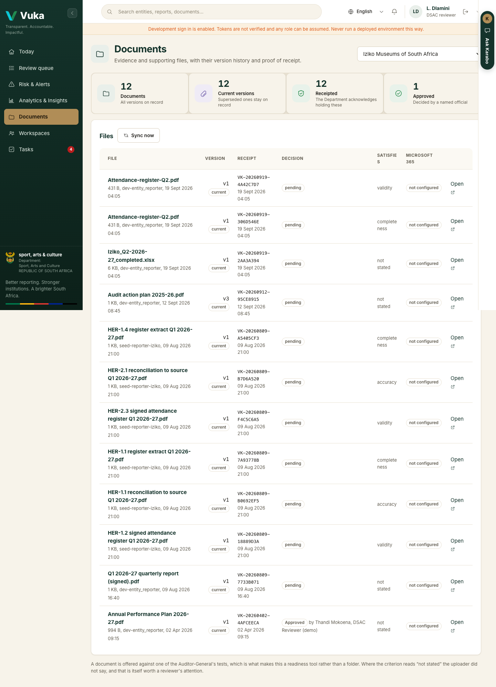
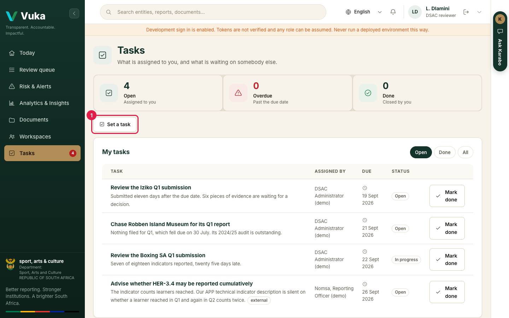
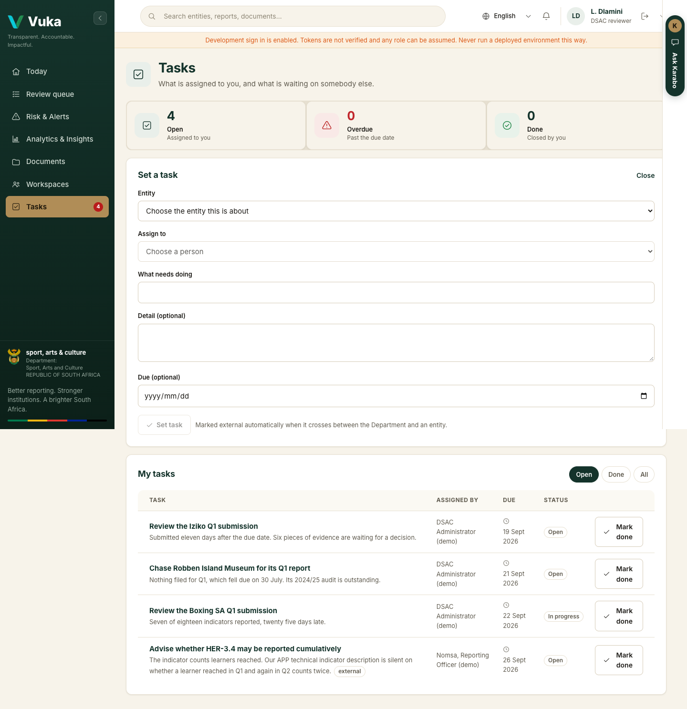
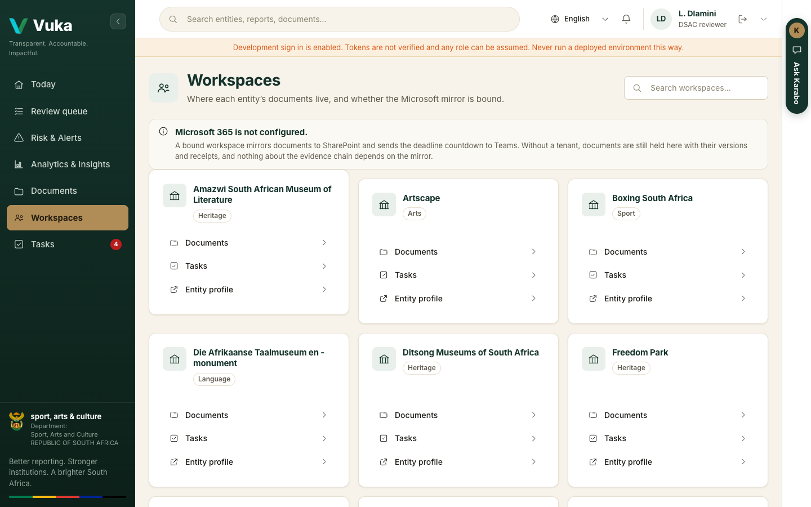
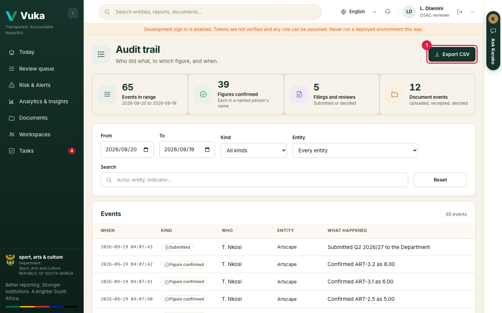
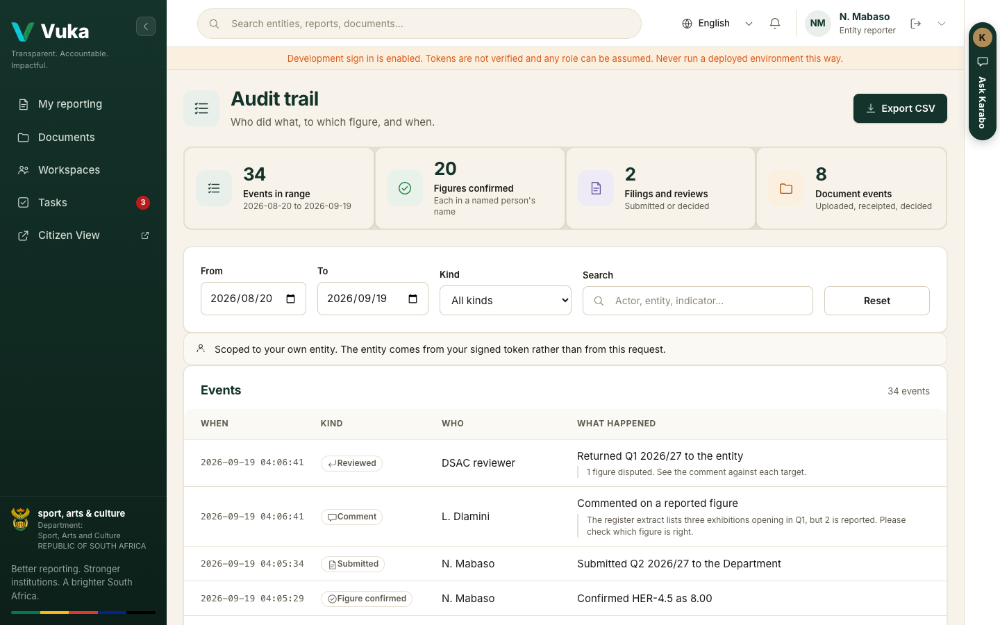
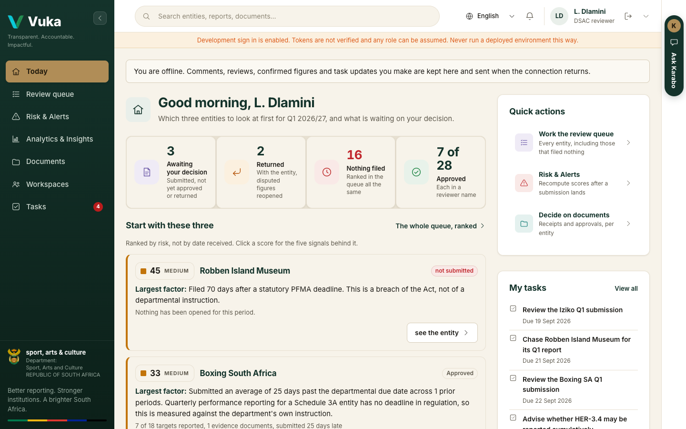

# Working together

[Back to the manual](README.md)

> **In short:** Documents with their versions and receipts, tasks you set for each other, live comments, the
> audit trail of who did what and when, and carrying on without a connection.

**Who this is for:** everyone who signs in: reporters, reviewers and administrators.

**What you will do:** find an entity's documents and their versions, comment on a filing, set and
close tasks, open an entity's workspace, read the audit trail, and keep working without a
connection.

---

## 1. Documents

Click **Documents** in the menu. A reporter sees their own entity's documents straight away. A DSAC
reviewer chooses the entity from the list at the top right.

The tiles count the **documents**, how many are **current versions**, how many are **receipted**
(the Department acknowledges holding them) and how many are **approved** by a named official.

Each row in **Files** shows:

- **Version.** Uploading a file with the same name makes it the next version, and the earlier ones
  are kept. **All versions** lists them.
- **Receipt.** Every upload gets a receipt number, so the entity can prove what it sent and when.
  **A receipt is not an approval.**
- **Decision.** Pending, approved or returned, and by whom.
- **Satisfies.** Which part of the Auditor-General's reliability test the document supports:
  validity, accuracy or completeness.
- **Microsoft 365.** Whether its copy in the entity's SharePoint library has synced, where one is
  bound (see [Setting up, step 4](00-administrator.md#4-connect-an-entity-to-microsoft-365)).
  **Sync now** picks up files saved in that library.
- **Open**, to read the document in the page.

Reporters add evidence against a figure while confirming it (see
[J1, step 5](J1-reporting-from-your-desk.md#5-attach-evidence)), and plans, reports and financials
from the phone **Documents** page (see
[J2](J2-reporting-from-a-phone.md#uploading-evidence-and-documents)).

## 2. Tasks

Click **Tasks** in the menu. The number on the menu item is how many of your tasks are still open.

The tiles count your tasks that are **open**, **overdue** and **done**. **My tasks** lists each one
with who set it, when it is due and its status. Filter with **Open**, **Done** and **All**, and
click **Mark done** when it is finished.

To give someone work, click **Set a task** (1).

1. Choose the **Entity** it is about.
2. Choose who it is **Assigned to**: someone at the Department, or one of that entity's own
   reporters. Nobody from another entity is offered.
3. Say **What needs doing**, add detail if it helps, and a due date if there is one.
4. Click **Set task**. It is on their list at once.

A task that crosses between the Department and an entity is marked **external**. Vuka works that
out from who set it and who it is for; nobody ticks it. Reporters, reviewers and administrators can
set tasks. The executive's view is read only, so it has no Tasks page.

## 3. Comments on a filing

Comments sit at the foot of a filing, on the reporter's confirmation screen and on the reviewer's
submission screen. A comment can be on the filing as a whole or against one figure. Both sides see
new comments appear within a few seconds, without reloading the page.

A reviewer's dispute is a comment against the figure (see
[J3, step 5](J3-reviewing-submissions.md#5-dispute-a-figure-you-do-not-believe)).

## 4. Workspaces

Click **Workspaces** in the menu. Each entity has one: the place its documents live, and whether
they are mirrored to Microsoft 365.

Each card opens that entity's **Documents**, its **Tasks** and its **Entity profile**. The notice at
the top says whether Microsoft 365 is configured for this deployment.

## 5. The audit trail

The audit trail answers who did what, to which figure, and when. Open it at the Vuka address
followed by `/logs`. **It has no item in the menu yet**, so type the address or keep a bookmark.

- The tiles count the **events in range**, the **figures confirmed** (each in a named person's
  name), the **filings and reviews**, and the **document events**.
- Narrow it by **From** and **To** dates, **Kind** of event, **Entity**, or a word in **Search**.
  **Reset** clears the filters.
- **Export CSV** (1) saves what you are looking at. The file states its own filters at the top, so
  whoever receives it knows the range it covers.

Each line is read from the record it describes, not from a separate log, so the trail and the data
cannot disagree. A name is shown as it was recorded at the time. Where no name was recorded the
line says **Not recorded** rather than leaving a blank.

A reporter sees their own entity only, and the page says so.

## 6. Working without a connection

Vuka keeps working when the connection drops. A strip across the top says you are offline.

- Screens you have already opened still show, with what they held when you last saw them.
- Comments, reviews, confirmed figures, submissions and task changes you make are **kept on this
  device** and listed until they are sent. They go, in order, as soon as the
  connection returns.
- The Department's own checks still apply when they arrive. If one is refused, the changes kept
  after it are held back rather than sent out of order.
- They are sent only under the same person's sign-in. **Signing out deletes them**, after asking,
  so a shared computer never opens on the last person's work.

On a phone, answers to indicators work the same way (see
[J2, step 5](J2-reporting-from-a-phone.md#5-if-you-lose-signal)).

---

Next: [Presenting Vuka](presenting.md)
